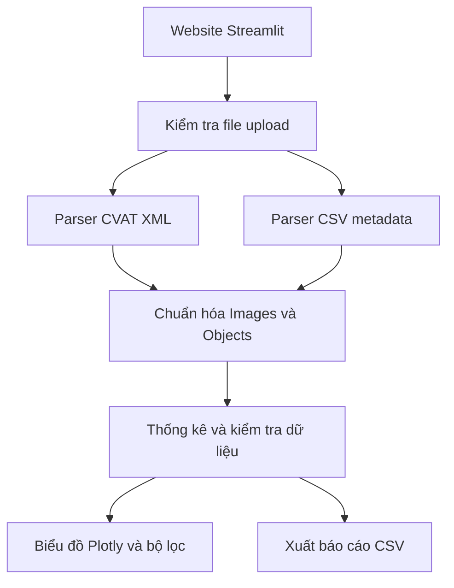

# Giải pháp kỹ thuật N2-05B

## Website phân tích phân bố class và thuộc tính dữ liệu từ CVAT

- Nhóm thực hiện: 5 người.
- Kiến trúc đề xuất: Python + Streamlit + Pandas + Plotly.
- Phạm vi đầu tiên: CVAT for images, bbox 2D và tags ảnh.
- Mục tiêu: công cụ dùng chung cho nhiều team, thống kê chính xác và hỗ trợ đánh giá độ bao phủ dữ liệu.

## 1. Kiến trúc



| Thành phần | Công nghệ | Vai trò |
|---|---|---|
| Website | Streamlit | Upload, cấu hình, bộ lọc, bảng, download |
| Parser XML | defusedxml | Đọc XML với cơ chế bảo vệ phù hợp |
| ZIP | zipfile | Đọc archive sau kiểm tra |
| Xử lý dữ liệu | Pandas | Chuẩn hóa, ghép metadata, thống kê |
| Biểu đồ | Plotly | Biểu đồ tương tác |
| Kiểm thử | pytest | Kiểm chứng parser và phép tính |
| Mã nguồn | Git/GitHub | Chia việc, tích hợp và quản lý phiên bản |

Chốt phiên bản thư viện và lưu dependencies khi coding. Chưa cần tách frontend/backend hoặc database. Colab dùng thử phần xử lý; website triển khai trên môi trường chạy riêng.

## 2. Đầu vào

| Đầu vào | Bắt buộc | Xử lý |
|---|---|---|
| CVAT for images XML | Có, hoặc ZIP chứa XML | Đọc ảnh, bbox, class, tags, thuộc tính |
| ZIP chứa XML | Thay XML | Nếu nhiều XML, yêu cầu chọn file |
| CSV metadata | Không | Ghép ngày/đêm, thời tiết theo đường dẫn ảnh |
| Ảnh gốc | Không | Preview và vẽ bbox |

Công bố rõ định dạng và loại nhãn hỗ trợ. Gặp polygon, mask hoặc định dạng khác phải báo phần chưa hỗ trợ và số nhãn bỏ qua. Chỉ có XML vẫn thống kê được.

## 3. Schema chuẩn hóa

### Bảng images

```text
dataset_id
image_id
image_path
width
height
timeofday
weather
metadata_source
```

### Bảng objects

```text
object_id
image_id
class_name
x_min, y_min, x_max, y_max
occluded
attributes
```

`image_id` có phạm vi trong dataset. Khi tổng hợp nhiều dataset, dùng khóa ghép `dataset_id + image_id`. Ghép CSV theo đường dẫn ảnh trong dataset, không chỉ theo tên cuối như `001.jpg`.

### Trường tính thêm

```python
bbox_width = x_max - x_min
bbox_height = y_max - y_min
area_ratio = bbox_width * bbox_height / (width * height)
```

Nếu bbox hoặc kích thước ảnh không hợp lệ: ghi nhận vấn đề và loại khỏi phép tính tương ứng; không âm thầm sửa tọa độ.

### Quy tắc metadata

- Có giá trị: đã gán day, night, rain…
- `unknown`: đã xem nhưng không xác định được.
- Thiếu: chưa cung cấp thông tin.
- CSV và tags mâu thuẫn: báo xung đột, cho người dùng chọn nguồn ưu tiên.
- Không có bbox chưa đủ để gọi ảnh là ảnh nền.
- Bbox nhỏ không chứng minh vật thể ở xa.

## 4. Module phân tích

| Module | Nội dung |
|---|---|
| Overview | Tổng ảnh, vật thể, class; ảnh không có nhãn vật thể |
| Class distribution | Số vật thể và số ảnh chứa từng class |
| Object size | Phân bố area_ratio; nhóm kích thước theo ngưỡng cấu hình |
| Attributes | Che khuất, thời tiết, ngày/đêm nếu có |
| Coverage | Kết hợp class × thời điểm × thời tiết |
| Metadata completeness | Có giá trị, unknown, thiếu |
| Target comparison | So thực tế với mục tiêu người dùng đặt |

Mỗi biểu đồ ghi đơn vị và mẫu số. Ví dụ: tỷ lệ ảnh ban đêm trên toàn bộ ảnh; tỷ lệ vật thể bị che khuất trên các vật thể có thông tin che khuất. Không mặc định class ít là lỗi.

## 5. Cấu hình cho nhiều team

Cho phép ánh xạ tên thuộc tính gốc sang trường chuẩn. Ví dụ dưới đây dùng quy ước khóa là tên chuẩn, giá trị là tên thuộc tính trong file nguồn:

```json
{
  "attribute_mapping": {
    "timeofday": "time_of_day",
    "weather": "weather"
  },
  "size_thresholds": {
    "small_max_area_ratio": 0.01,
    "medium_max_area_ratio": 0.05
  },
  "targets": {
    "night_image_ratio": 0.20
  }
}
```

Ngưỡng trên chỉ là ví dụ, không phải chuẩn chung. Cho tải và upload lại cấu hình để tái lập báo cáo. Tự đọc class từ file, không hard-code car/person.

## 6. Giao diện

| Tab | Nội dung |
|---|---|
| Dữ liệu | Upload, chọn XML, ánh xạ metadata, lỗi và cảnh báo |
| Tổng quan | Chỉ số và phân bố class |
| Phân tích | Thuộc tính, kích thước, bộ lọc kết hợp |
| Báo cáo | Mục tiêu, khoảng thiếu, export CSV và cấu hình |

Lọc theo thời tiết/ngày đêm: lấy image_id trước rồi lọc vật thể thuộc ảnh đó. Lọc class: phân biệt số vật thể của class với số ảnh chứa class.

## 7. Upload, hiệu năng và dữ liệu người dùng

- Xử lý riêng theo phiên; không dùng biến toàn cục chứa dataset người dùng.
- Giới hạn dung lượng upload và tổng dung lượng giải nén.
- Kiểm tra đường dẫn trong ZIP, số file, tỷ lệ nén; tránh giải nén tùy ý.
- Chỉ đọc file hỗ trợ; không thực thi nội dung upload.
- Chưa lưu lâu dài; công bố cơ chế xử lý và xóa file tạm.
- Tính thống kê sau upload; bộ lọc dùng dữ liệu đã chuẩn hóa.
- Không cần database trong MVP; chỉ bổ sung khi cần tài khoản, lịch sử dataset hoặc cộng tác.

## 8. Cấu trúc mã nguồn

```text
app.py
parsers/
    cvat_images.py
    metadata_csv.py
core/
    schema.py
    validation.py
    metadata_merge.py
    statistics.py
    targets.py
ui/
    upload.py
    overview.py
    analysis.py
    reports.py
tests/
    fixtures/
    test_parser.py
    test_statistics.py
requirements.txt
README.md
```

Tách thống kê khỏi Streamlit để kiểm thử độc lập và tái sử dụng.

## 9. Kiểm thử ưu tiên

| Tình huống | Kết quả cần xác nhận |
|---|---|
| Một ảnh nhiều bbox cùng class | Đúng số vật thể; một ảnh chứa class |
| Ảnh không bbox | Vẫn nằm trong tổng ảnh |
| Không tags | Không lỗi; metadata thiếu |
| CSV trùng hoặc không khớp | Báo vấn đề; không ghép nhầm |
| CSV và tags mâu thuẫn | Báo xung đột; áp dụng nguồn đã chọn |
| Bbox sai hoặc kích thước ảnh bằng 0 | Không làm sai thống kê kích thước |
| Bộ lọc kết hợp | Khớp tập mẫu đối chiếu bằng tay |

## 10. Mở rộng 3D

- Dùng chung bảng frame/ảnh và trường class.
- Tách objects_2d và objects_3d, không ép vào cùng cột hình học.
- 3D lưu tâm, kích thước, orientation, đơn vị và hệ tọa độ.
- Dùng chung thống kê class; thống kê kích thước riêng.
- Chỉ tính khoảng cách hoặc mật độ điểm khi có dữ liệu và quy ước phù hợp.
- Chưa làm viewer point cloud trong bản đầu.

## 11. Thứ tự triển khai

1. Parser XML và kiểm tra đầu vào.
2. Bộ dữ liệu nhỏ có đáp án kiểm chứng độc lập.
3. Thống kê và ghép metadata chính xác.
4. Dashboard, bộ lọc, cấu hình và export.
5. Dùng thử với ít nhất hai team.
6. Đo độ chính xác, thời gian so với thủ công; sửa lỗi và triển khai.

Ưu tiên thống kê đúng và bằng chứng đánh giá trước khi mở rộng giao diện hoặc định dạng.
