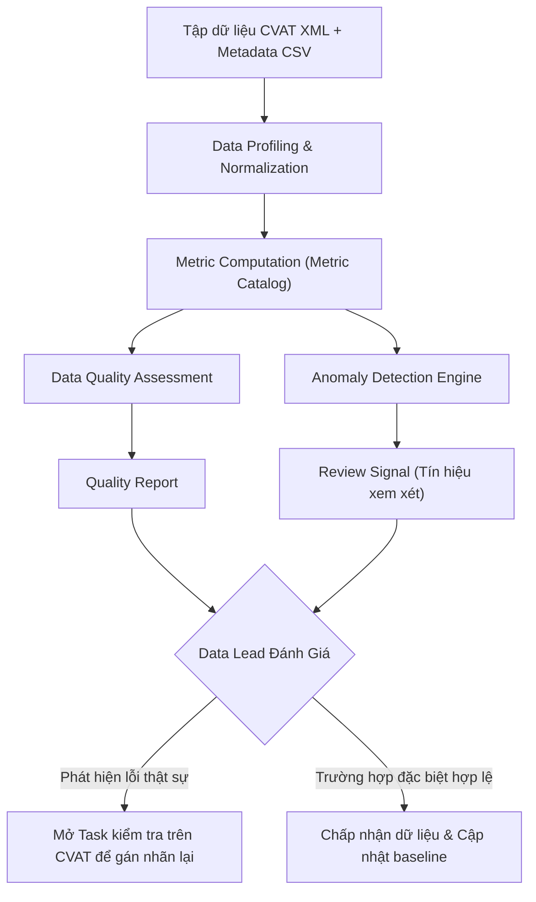

# Metric Catalog: N2-05B - Dashboard Phân Bố Class và Thuộc Tính Dữ Liệu

> **Tài liệu đặc tả danh mục chỉ số (Metric Catalog)**  
> **Dự án**: N2-05B - Website phân tích phân bố class và thuộc tính dữ liệu từ CVAT  
> **Đối tượng sử dụng**: Nhóm phát triển sinh viên, Data Lead, Annotation Team  
> **Trạng thái**: Đã chốt lý thuyết & đặc tả chuẩn (Trước khi bước vào Implementation)

---

## Mục lục

1. [Mục tiêu tài liệu](#1-mục-tiêu-tài-liệu)
2. [Nguyên tắc cốt lõi](#2-nguyên-tắc-cốt-lõi)
3. [Danh mục Metric chi tiết (Metric Catalog)](#3-danh-mục-metric-chi-tiết-metric-catalog)
   - [3.1 Dataset Metrics](#31-dataset-metrics)
   - [3.2 Class Metrics](#32-class-metrics)
   - [3.3 Image / Object Metrics](#33-image--object-metrics)
   - [3.4 Bounding Box Metrics](#34-bounding-box-metrics)
   - [3.5 Bounding Box Quality Metrics](#35-bounding-box-quality-metrics)
   - [3.6 Occlusion Metrics](#36-occlusion-metrics)
   - [3.7 Weather Metrics](#37-weather-metrics)
   - [3.8 Timeofday Metrics](#38-timeofday-metrics)
   - [3.9 Data Quality Metrics](#39-data-quality-metrics)
   - [3.10 Parser & Compatibility Metrics](#310-parser--compatibility-metrics)
4. [Chuẩn hóa phương pháp thống kê mô tả](#4-chuẩn-hóa-phương-pháp-thống-kê-mô-tả)
5. [Quan hệ: Metric → Data Quality](#5-quan-hệ-metric--data-quality)
6. [Quan hệ: Metric → Anomaly Detection](#6-quan-hệ-metric--anomaly-detection)
7. [Cơ chế Review Signal](#7-cơ-chế-review-signal)
8. [Phân định độ ưu tiên MVP (P0 vs P1)](#8-phân-định-độ-ưu-tiên-mvp-p0-vs-p1)
9. [Những điều Metric KHÔNG ĐƯỢC kết luận](#9-những-điều-metric-không-được-kết-luận)
10. [Ví dụ minh họa End-to-End](#10-ví-dụ-minh-họa-end-to-end)
11. [Kết luận và các bước tiếp theo](#11-kết-luận-và-các-bước-tiếp-theo)

---

## 1. Mục tiêu tài liệu

Tài liệu này được biên soạn bằng tiếng Việt nhằm phục vụ nhóm sinh viên thực hiện dự án **N2-05B**. Mục đích chính là thống nhất toàn diện về mặt lý thuyết, phương pháp tính toán và ý nghĩa thực tế của tất cả các chỉ số (metrics) sẽ hiển thị trên dashboard hoặc dùng để phân tích chất lượng tập dữ liệu CVAT.

Tài liệu trả lời trực diện 7 câu hỏi trọng tâm:
1. **Dataset cần đo những chỉ số nào?**
2. **Mỗi chỉ số được tính như thế nào? (Công thức toán học & logic xử lý)**
3. **Input của metric là gì? (Bảng dữ liệu, trường thuộc tính, kiểu dữ liệu)**
4. **Output của metric là gì? (Kiểu dữ liệu đầu ra, đơn vị đo)**
5. **Metric có ý nghĩa gì đối với Data Lead?**
6. **Metric nào dùng để đánh giá Chất lượng Dữ liệu (Data Quality)?**
7. **Metric nào có thể làm đầu vào cho Phát hiện Bất thường (Anomaly Detection)?**

### Phân biệt 3 khái niệm nền tảng

Để tránh hiểu nhầm trong quá trình triển khai, toàn bộ thành viên trong nhóm phải tuân thủ phân tầng sau:

```
[ METRIC ]           -->  Mô tả sự thật khách quan của tập dữ liệu (distribution, counts, ratios)
       ↓
[ QUALITY METRIC ]   -->  Đo lường độ toàn vẹn, tính hợp lệ và độ bao phủ của dữ liệu (validity, completeness)
       ↓
[ ANOMALY RULE ]     -->  Phát hiện các mẫu (patterns) lệch bất thường cần con người kiểm tra (flag for review)
```

> **Ghi nhớ sống còn**: **Không được đồng nhất "Anomaly" (sự bất thường) với "Annotation Error" (lỗi gán nhãn).**  
> Một điểm dữ liệu bất thường (ví dụ: ảnh có 100 xe máy, hoặc class hiếm chỉ có 2 vật thể) có thể hoàn toàn chính xác theo thế giới thực (ví dụ: cảnh tắc đường ngã tư giờ cao điểm, hoặc loại xe chuyên dụng hiếm gặp). Metric chỉ phản ánh số liệu, không được vội vàng phán xét đúng/sai.

---

## 2. Nguyên tắc cốt lõi

Mọi thành viên phát triển và người dùng dashboard phải nắm vững các nguyên tắc sau:

1. **Định nghĩa và công thức minh bạch**: Mỗi metric phải có tên rõ ràng, định dạng đơn vị chuẩn (số nguyên, số thực, phần trăm) và công thức toán học tường minh.
2. **Không trộn lẫn Object Count và Image Count**:
   - `Object Count`: Số lượng vật thể (bounding box).
   - `Image Count`: Số lượng ảnh chứa ít nhất một vật thể đó.
   - Trộn lẫn hai số liệu này sẽ dẫn đến sai lệch nghiêm trọng khi đánh giá độ bao phủ dữ liệu.
3. **Không tự suy diễn nguyên nhân từ số liệu (No Speculation)**:
   - Metric chỉ mô tả hiện tượng, không giải thích động cơ hay nguyên nhân chủ quan của annotator.
4. **Không tự động kết luận lỗi gán nhãn**:
   - Không kết luận class ít xuất hiện là do annotator bỏ sót.
   - Không kết luận ảnh có nhiều box là do annotator gán nhầm.
5. **BBox size KHÔNG phản ánh khoảng cách vật lý**:
   - Kích thước bounding box nhỏ (`area_ratio` nhỏ) **không chứng minh** vật thể ở xa camera (vật thể có thể là một con ốc vít nhỏ đặt ngay sát ống kính).
6. **Phân biệt rạch ròi giữa `unknown` và `missing`**:
   - `missing`: Thuộc tính hoàn toàn chưa được nhập/chưa được thu thập trong dữ liệu.
   - `unknown`: Annotator đã quan sát kỹ nhưng dựa trên ngữ cảnh ảnh không thể xác định được (ví dụ: trời nhá nhem tối không rõ mây hay sương, thời tiết không thể nhận định).
   - Không được gộp hai trạng thái này vào nhau khi chưa có yêu cầu cụ thể.
7. **Tính toán dựa trên dữ liệu đã chuẩn hóa (Normalized Data)**:
   - Tất cả metrics được tính toán sau khi dữ liệu đã đi qua parser và schema chuẩn hóa (`images`, `objects`).
8. **Không âm thầm sửa dữ liệu đầu vào (No Silent Fixes)**:
   - Tool tuyệt đối không tự ý hoán đổi tọa độ `x_min`, `x_max`, không tự kẹp tọa độ (clamp) khi bounding box bị tràn viền (out-of-bounds) mà không ghi nhận.
9. **Ghi nhận riêng dữ liệu không hợp lệ (Invalid Data Quarantine)**:
   - Bản ghi lỗi phải được đếm và chuyển vào danh sách kiểm toán chất lượng (`Data Quality`), đồng thời loại khỏi các phép tính phân bố kích thước/tọa độ để không làm lệch thống kê chung.
10. **Tách biệt Metric Catalog và Anomaly Threshold**:
    - Metric Catalog chỉ định nghĩa các phép đo. Các ngưỡng kích hoạt cảnh báo (thresholds) thuộc về **Anomaly Rule Catalog** và phải có khả năng cấu hình linh hoạt (configurable), không hard-code cứng nhắc.

---

## 3. Danh mục Metric chi tiết (Metric Catalog)

Mỗi metric trong danh mục được đặc tả chuẩn hóa theo 7 thuộc tính:
- **Tên metric**: Tên định danh chuẩn trong mã nguồn
- **Mô tả**: Ý nghĩa đo lường
- **Công thức**: Cách thức tính toán
- **Input**: Trường dữ liệu và kiểu dữ liệu đầu vào
- **Output**: Kiểu dữ liệu và đơn vị trả về
- **Ý nghĩa cho Data Lead**: Giá trị thực tế khi quản lý dữ liệu
- **Vai trò Data Quality & Anomaly Detection**: Ứng dụng trong kiểm định và phát hiện bất thường

---

### 3.1 Dataset Metrics

Nhóm chỉ số ở cấp độ toàn bộ tập dữ liệu (dataset level).

#### 1. `total_images`
- **Mô tả**: Tổng số lượng hình ảnh có trong tập dữ liệu.
- **Công thức**: $\sum 1$ cho mỗi bản ghi ảnh hợp lệ trong bảng `images`.
- **Input**: Bảng `images`, cột `image_id`.
- **Output**: Integer $\ge 0$.
- **Ý nghĩa cho Data Lead**: Quy mô tổng thể của đợt bàn giao dữ liệu.
- **Data Quality**: Đối chiếu với manifest hoặc danh sách file thực tế thu thập.
- **Anomaly Detection**: Kiểm tra tập dữ liệu rỗng (`total_images = 0`).

#### 2. `total_objects`
- **Mô tả**: Tổng số lượng vật thể bounding box hợp lệ được đánh nhãn.
- **Công thức**: $\sum 1$ cho mỗi bản ghi trong bảng `objects` hợp lệ.
- **Input**: Bảng `objects`, cột `object_id`.
- **Output**: Integer $\ge 0$.
- **Ý nghĩa cho Data Lead**: Tổng khối lượng công việc gán nhãn đã hoàn thành.
- **Data Quality**: Xác định tải lượng dữ liệu phục vụ huấn luyện.
- **Anomaly Detection**: Phát hiện bất thường khi tỷ lệ object/image quá thấp hoặc bằng 0.

#### 3. `total_classes`
- **Mô tả**: Tổng số lớp đối tượng (categories) phân biệt xuất hiện trong dataset.
- **Công thức**: $\text{Count}(\text{Unique}(class\_name))$.
- **Input**: Bảng `objects`, cột `class_name` (chuỗi ký tự).
- **Output**: Integer $\ge 0$.
- **Ý nghĩa cho Data Lead**: Độ đa dạng danh mục nhãn so với bộ ontology/taxonomy đã thiết kế.
- **Data Quality**: Phát hiện thiếu class theo đặc tả dự án hoặc xuất hiện class lạ do gõ sai chính tả.
- **Anomaly Detection**: Input cho rule kiểm tra độ bao phủ taxonomy.

#### 4. `annotated_image_count`
- **Mô tả**: Số lượng ảnh có chứa ít nhất 1 bounding box hợp lệ.
- **Công thức**: $\sum_{img \in images} \mathbb{I}(N_{objects}(img) > 0)$.
- **Input**: Bảng `images` ghép `objects` theo `image_id`.
- **Output**: Integer $\ge 0$.
- **Ý nghĩa cho Data Lead**: Số ảnh thực tế cung cấp mẫu dương tính (positive samples).
- **Data Quality**: Kiểm tra tỷ lệ ảnh có dữ liệu gán nhãn.
- **Anomaly Detection**: Tín hiệu so sánh với tỷ lệ ảnh nền mong đợi.

#### 5. `unannotated_image_count`
- **Mô tả**: Số lượng ảnh không có bất kỳ bounding box nào.
- **Công thức**: $\sum_{img \in images} \mathbb{I}(N_{objects}(img) = 0)$.
- **Input**: Bảng `images` ghép `objects` theo `image_id`.
- **Output**: Integer $\ge 0$.
- **Ý nghĩa cho Data Lead**: Nhận biết số lượng ảnh nền hoặc ảnh annotator chưa xử lý.
- **Data Quality**: Phát hiện nguy cơ sót ảnh trong các batch bàn giao.
- **Anomaly Detection**: Input cho rule cảnh báo tỷ lệ ảnh không nhãn vượt dự kiến.

#### Quan hệ toán học quan trọng:
$$\text{annotated\_image\_count} + \text{unannotated\_image\_count} = \text{total\_images}$$

---

### 3.2 Class Metrics

Nhóm chỉ số đo lường phân bố theo từng lớp đối tượng (class level).

#### 1. `class_object_count`
- **Mô tả**: Tổng số lượng vật thể thuộc về một class cụ thể $c$.
- **Công thức**: $N_{objects}(c) = \sum_{obj \in objects} \mathbb{I}(obj.class\_name = c)$.
- **Input**: Bảng `objects`, cột `class_name`.
- **Output**: Integer $\ge 0$.
- **Ý nghĩa cho Data Lead**: Khối lượng mẫu học của từng class.
- **Data Quality**: Phát hiện các class có mẫu quá ít (thiếu hụt dữ liệu).
- **Anomaly Detection**: Input cho việc xác định minority class hoặc majority class.

#### 2. `class_image_count`
- **Mô tả**: Số lượng ảnh có chứa ít nhất 1 vật thể thuộc class $c$.
- **Công thức**: $N_{images}(c) = \sum_{img \in images} \mathbb{I}(\exists obj \in img: obj.class\_name = c)$.
- **Input**: Bảng `images` ghép `objects` theo `image_id`.
- **Output**: Integer $\ge 0$.
- **Ý nghĩa cho Data Lead**: Độ phân tán bối cảnh của class trên tập dữ liệu.
- **Data Quality**: Đánh giá độ phủ bối cảnh, tránh hiện tượng class bị dồn vào một vài ảnh.
- **Anomaly Detection**: Input phát hiện class bị cụm (clustering anomaly).

#### 3. `class_object_ratio`
- **Mô tả**: Tỷ lệ số vật thể của class $c$ trên tổng số vật thể của dataset.
- **Công thức**: $\text{class\_object\_ratio}(c) = \frac{\text{class\_object\_count}(c)}{\text{total\_objects}}$ (với $\text{total\_objects} > 0$).
- **Input**: `class_object_count(c)`, `total_objects`.
- **Output**: Float trong đoạn $[0.0, 1.0]$.
- **Ý nghĩa cho Data Lead**: Đo lường mức độ mất cân bằng lớp đối tượng (Class Imbalance).
- **Data Quality**: Đánh giá độ lệch phân bố nhãn phục vụ huấn luyện mô hình.
- **Anomaly Detection**: Input cho rule phát hiện class cực hiếm (Extreme Rare Class) hoặc class áp đảo (Over-dominant Class).

#### 4. `class_image_ratio`
- **Mô tả**: Tỷ lệ số ảnh có xuất hiện class $c$ trên tổng số ảnh của dataset.
- **Công thức**: $\text{class\_image\_ratio}(c) = \frac{\text{class\_image\_count}(c)}{\text{total\_images}}$ (với $\text{total\_images} > 0$).
- **Input**: `class_image_count(c)`, `total_images`.
- **Output**: Float trong đoạn $[0.0, 1.0]$.
- **Ý nghĩa cho Data Lead**: Tần suất bắt gặp class theo từng khung hình.
- **Data Quality**: Đo lường độ đại diện theo bối cảnh môi trường.
- **Anomaly Detection**: Input so sánh tương quan giữa `class_object_ratio` và `class_image_ratio`.

#### Phân biệt Object Count và Image Count:
> **Ví dụ trực quan:**  
> Giả sử có một bức ảnh chụp bãi đỗ xe chứa **10 chiếc xe GreenSM**:
> - `class_object_count(GreenSM)` **tăng 10**.
> - `class_image_count(GreenSM)` **chỉ tăng 1**.
> 
> Tuyệt đối không dùng Object Count để thay thế Image Count khi đánh giá độ phân tán của dữ liệu.

---

### 3.3 Image / Object Metrics

Nhóm chỉ số đo lường mật độ phân bố vật thể trên từng bức ảnh (per-image density).

#### 1. `objects_per_image`
- **Mô tả**: Dãy số lượng vật thể trên từng bức ảnh trong tập dữ liệu.
- **Công thức**: Mảng $[N_{objects}(img_1), N_{objects}(img_2), \dots, N_{objects}(img_n)]$ cho mọi $img \in images$.
- **Input**: Nhóm `objects` theo `image_id`.
- **Output**: Mảng các số nguyên Integer $\ge 0$.
- **Ý nghĩa cho Data Lead**: Phân bố mật độ cảnh quan (cảnh thưa thớt vs cảnh đông đúc).
- **Data Quality**: Nhận diện hình ảnh không nhãn hoặc hình ảnh có mật độ box bất thường.
- **Anomaly Detection**: Chuỗi dữ liệu nền tảng để chạy các phép phân vị và xác định điểm dị biệt (density outlier).

#### 2. `mean_objects_per_image`
- **Mô tả**: Số lượng vật thể trung bình trên một bức ảnh.
- **Công thức**: 
  $$\text{mean\_objects\_per\_image} = \frac{\text{total\_objects}}{\text{total\_images}}$$
  *(Tính trên toàn bộ tập ảnh, bao gồm cả các ảnh có 0 vật thể).*
- **Input**: `total_objects`, `total_images`.
- **Output**: Float $\ge 0.0$.
- **Ý nghĩa cho Data Lead**: Chỉ số trung bình tổng quan về độ phức tạp của dataset.
- **Data Quality**: Đánh giá độ đồng đều trung bình.
- **Anomaly Detection**: So sánh giữa các batch dữ liệu khác nhau.

#### 3. `median_objects_per_image`
- **Mô tả**: Trung vị số lượng vật thể trên một bức ảnh.
- **Công thức**: $\text{Median}(\text{objects\_per\_image})$.
- **Input**: Dãy `objects_per_image`.
- **Output**: Float hoặc Integer $\ge 0$.
- **Ý nghĩa cho Data Lead**: Thước đo trung tâm tin cậy, không bị méo mó bởi một vài ảnh có quá nhiều vật thể.
- **Data Quality**: Xác định mức độ mật độ tiêu biểu của tập dữ liệu.
- **Anomaly Detection**: Mốc trung tâm dùng trong các rule dạng khoảng cách trung vị.

#### 4. `min_objects_per_image` & `max_objects_per_image`
- **Mô tả**: Số vật thể ít nhất và nhiều nhất trong một bức ảnh của dataset.
- **Công thức**: $\min(\text{objects\_per\_image})$ và $\max(\text{objects\_per\_image})$.
- **Input**: Dãy `objects_per_image`.
- **Output**: Integer $\ge 0$.
- **Ý nghĩa cho Data Lead**: Xác định biên cực tiểu và cực đại của mật độ cảnh.
- **Data Quality**: `min = 0` xác nhận có ảnh chưa gán nhãn; `max` quá lớn gợi ý cảnh cực kỳ đông đúc.
- **Anomaly Detection**: `max_objects_per_image` kích hoạt rà soát các ảnh có nguy cơ gán nhãn chồng chéo hoặc cảnh siêu đông đúc.

---

### 3.4 Bounding Box Metrics

Nhóm chỉ số mô tả đặc trưng hình học của các hộp bao vật thể 2D hợp lệ. Tọa độ chuẩn $[x_{min}, y_{min}, x_{max}, y_{max}]$ theo trục pixel ảnh gốc $(0,0)$ ở góc trên bên trái.

#### 1. `bbox_width` & `bbox_height`
- **Mô tả**: Chiều rộng và chiều cao của hộp bao (pixel).
- **Công thức**: 
  $$\text{bbox\_width} = x_{max} - x_{min}$$
  $$\text{bbox\_height} = y_{max} - y_{min}$$
- **Input**: Bảng `objects`, các cột tọa độ `x_min`, `x_max`, `y_min`, `y_max`.
- **Output**: Float (hoặc Integer) $> 0$, đơn vị pixel.
- **Ý nghĩa cho Data Lead**: Kích thước biểu kiến của vật thể trên không gian ảnh.
- **Data Quality**: Loại bỏ và ghi nhận các box có kích thước $\le 0$.
- **Anomaly Detection**: Input phát hiện các box dẹt hoặc mảnh bất thường (tỷ lệ $w/h$ hoặc $h/w$ dị biệt).

#### 2. `bbox_area`
- **Mô tả**: Diện tích của hộp bao vật thể tính bằng pixel vuông.
- **Công thức**: $\text{bbox\_area} = \text{bbox\_width} \times \text{bbox\_height}$.
- **Input**: `bbox_width`, `bbox_height`.
- **Output**: Float $> 0$, đơn vị $\text{pixel}^2$.
- **Ý nghĩa cho Data Lead**: Quy mô diện tích chiếm dụng của nhãn trên ảnh.
- **Data Quality**: Phát hiện các box diện tích bằng 0 (`zero_area_bbox_count`).
- **Anomaly Detection**: Input nhận diện các box cực nhỏ hoặc box bao trùm toàn màn hình.

#### 3. `area_ratio`
- **Mô tả**: Tỷ lệ diện tích của bounding box so với tổng diện tích khung hình ảnh.
- **Công thức**: 
  $$\text{area\_ratio} = \frac{\text{bbox\_area}}{W_{image} \times H_{image}}$$
- **Input**: `bbox_area`, `width`, `height` từ bảng `images`.
- **Output**: Float trong khoảng $(0.0, 1.0]$.
- **Ý nghĩa cho Data Lead**: Phân nhóm vật thể theo kích thước tương đối (small, medium, large).
- **Data Quality**: Kiểm tra tính hợp lệ của phép chiếu hình học.
- **Anomaly Detection**: Input phát hiện box siêu nhỏ (potential noise/point click) hoặc box khổng lồ chiếm toàn bộ ảnh.

#### Nguyên tắc phân biệt hình học:
> **CẢNH BÁO:**  
> - Bounding box nhỏ (`area_ratio` nhỏ) **KHÔNG CHỨNG MINH** vật thể ở khoảng cách xa. Vật thể nhỏ có thể là một chi tiết bé ở cự ly gần.
> - Dashboard ghi nhận kích thước hình học trên ảnh (2D image space), không kết luận khoảng cách hay kích thước vật lý 3D trong thế giới thực.

---

### 3.5 Bounding Box Quality Metrics

Nhóm chỉ số đo lường các lỗi hình học vi phạm tính toàn vẹn toán học của bounding box.

#### Quan hệ phân cấp giữa các chỉ số chất lượng BBox:
- `invalid_bbox_count` là **tổng số lượng bounding box không hợp lệ** (tổng hợp tất cả các lỗi tọa độ đảo, suy biến, diện tích không dương).
- `zero_area_bbox_count` là **một trường hợp cụ thể (subset)** thuộc `invalid_bbox_count`.
- `out_of_bounds_bbox_count` ghi nhận các box hợp lệ về chiều nhưng vượt ra ngoài khung hình ảnh.
- `invalid_image_dimension_count` là lỗi kích thước của ảnh chứa nhãn.

| Tên Metric | Kiểu dữ liệu | Điều kiện vi phạm / Công thức | Ý nghĩa cho Data Lead & Xử lý |
|---|---|---|---|
| `invalid_bbox_count` | Integer | $x_{min} \ge x_{max}$ HOẶC $y_{min} \ge y_{max}$ HOẶC $w \le 0$ HOẶC $h \le 0$ | Tổng số box hỏng toán học. **Loại khỏi thống kê kích thước, ghi nhận báo cáo.** |
| `zero_area_bbox_count` | Integer | $w \le 0$ HOẶC $h \le 0$ HOẶC $\text{area} \le 0$ *(Subset của invalid)* | Box suy biến thành điểm hoặc đường thẳng. Không thể dùng huấn luyện object detection. |
| `out_of_bounds_bbox_count` | Integer | $x_{min} < 0$ HOẶC $y_{min} < 0$ HOẶC $x_{max} > W_{img}$ HOẶC $y_{max} > H_{img}$ | Box tràn ra ngoài biên ảnh. Ghi nhận riêng, không tự động cắt xén (clip). |
| `invalid_image_dimension_count` | Integer | $W_{img} \le 0$ HOẶC $H_{img} \le 0$ | Ảnh có metadata kích thước lỗi. Không thể tính được `area_ratio`. |

#### Nguyên tắc kỹ thuật:
- **Không tự động sửa (No Auto-fix)**: Tool tuyệt đối không tự hoán đổi tọa độ hay ép box về biên.
- **Cách ly dữ liệu (Quarantine)**: Toàn bộ bản ghi lỗi phải được ghi nhận danh sách chi tiết (Image ID, Object ID) và loại trừ khỏi các phép tính phân bố liên tục để không làm méo mó kết quả.

---

### 3.6 Occlusion Metrics

Nhóm chỉ số mô tả mức độ che khuất của vật thể. Trong định dạng chuẩn CVAT, thuộc tính này thường là cờ nhị phân `occluded` (0 hoặc 1).

#### 1. `occluded_count` & `non_occluded_count`
- **Mô tả**: Số lượng vật thể được đánh dấu bị che khuất (`occluded = 1`) và không bị che khuất (`occluded = 0`).
- **Công thức**: $\sum_{obj} \mathbb{I}(obj.occluded = 1)$ và $\sum_{obj} \mathbb{I}(obj.occluded = 0)$.
- **Input**: Bảng `objects`, cột `occluded`.
- **Output**: Integer $\ge 0$.
- **Ý nghĩa cho Data Lead**: Định lượng mức độ phức tạp do che chắn lẫn nhau trong tập dữ liệu.

#### 2. `occlusion_rate`
- **Mô tả**: Tỷ lệ vật thể bị che khuất trên toàn bộ tập dữ liệu.
- **Công thức**: 
  $$\text{occlusion\_rate} = \frac{\text{occluded\_count}}{\text{total\_objects}}$$ (với $\text{total\_objects} > 0$).
- **Input**: `occluded_count`, `total_objects`.
- **Output**: Float trong đoạn $[0.0, 1.0]$.
- **Ý nghĩa cho Data Lead**: Tổng quan độ khó của tập dữ liệu đối với mô hình nhận diện.
- **Data Quality**: Kiểm tra xem thuộc tính `occluded` có được annotator ghi nhận thực tế hay bị bỏ quên toàn bộ.
- **Anomaly Detection**: Tín hiệu phân bố để so sánh giữa các đợt dữ liệu hoặc giữa các annotator.

#### 3. `occlusion_rate_by_class`
- **Mô tả**: Tỷ lệ vật thể bị che khuất tính riêng cho từng class $c$.
- **Công thức**: $\text{occlusion\_rate\_by\_class}(c) = \frac{\text{occluded\_count}(c)}{\text{class\_object\_count}(c)}$.
- **Input**: `occluded_count(c)`, `class_object_count(c)`.
- **Output**: Float trong đoạn $[0.0, 1.0]$.
- **Ý nghĩa cho Data Lead**: Nhận biết đặc thù che khuất của từng loại đối tượng (ví dụ: người đi bộ trong đám đông vs biển báo giao thông trên cao).
- **Data Quality & Anomaly Detection**: Là tín hiệu phân bố (distribution signal) để Data Lead xem xét.  
  *Lưu ý*: Tỷ lệ che khuất thấp hoặc cao **không tự động đồng nghĩa với việc gán nhãn sai hay annotator bỏ sót**, mà cần Data Lead đối chiếu với ngữ cảnh thực tế của dữ liệu.

---

### 3.7 Weather Metrics

Nhóm chỉ số mô tả điều kiện thời tiết của cảnh chụp ảnh. Dữ liệu thời tiết đến từ tag XML hoặc file CSV metadata ghép nối.

#### Các trạng thái chuẩn hóa:
- `clear` (Trời quang / Nắng)
- `rain` (Mưa)
- `fog` (Sương mù)
- `overcast` (Nhiều mây / U ám)
- `unknown` (Đã xem xét ảnh nhưng ngữ cảnh không đủ để xác định)
- `missing` (Không có trường thông tin này trong metadata/chưa thu thập)

#### Danh sách chỉ số:

| Tên Metric | Kiểu dữ liệu | Mô tả | Công thức |
|---|---|---|---|
| `weather_image_count` | Integer | Số lượng ảnh thuộc từng trạng thái thời tiết | $\sum_{img} \mathbb{I}(img.weather = state)$ |
| `weather_image_ratio` | Float [0.0, 1.0] | Tỷ lệ số ảnh của từng trạng thái thời tiết trên tổng số ảnh | $\frac{\text{weather\_image\_count}(state)}{\text{total\_images}}$ |
| `weather_distribution` | Table / Dict | Bảng phân bố tổng hợp số lượng và tỷ lệ ảnh theo thời tiết | Tổng hợp toàn bộ các trạng thái |
| `weather_object_distribution` | Table / Dict | Phân bố số lượng vật thể tương ứng với từng điều kiện thời tiết | $\sum_{obj \in img: img.weather = state} 1$ |

#### Quy tắc phân biệt:
- **`unknown` $\neq$ `missing`**: Nhìn ảnh nhưng không rõ thời tiết khác hoàn toàn với việc pipeline thu thập bị khuyết trường dữ liệu. Không được gộp 2 trạng thái này nếu chưa có chỉ định từ Data Lead.
- Thời tiết hiếm gặp (ví dụ tập dữ liệu chỉ có 2 ảnh `fog`) không đồng nghĩa với việc metadata bị gán sai.

---

### 3.8 Timeofday Metrics

Nhóm chỉ số mô tả điều kiện thời điểm trong ngày (ánh sáng môi trường) của cảnh chụp.

#### Các trạng thái chuẩn hóa:
- `day` (Ban ngày)
- `night` (Ban đêm)
- `dawn_dusk` (Bình minh / Hoàng hôn)
- `unknown` (Đã xem xét nhưng không xác định được)
- `missing` (Thiếu thông tin metadata)

#### Danh sách chỉ số:

| Tên Metric | Kiểu dữ liệu | Mô tả | Công thức |
|---|---|---|---|
| `timeofday_image_count` | Integer | Số lượng ảnh thuộc từng thời điểm trong ngày | $\sum_{img} \mathbb{I}(img.timeofday = state)$ |
| `timeofday_image_ratio` | Float [0.0, 1.0] | Tỷ lệ số ảnh của từng thời điểm trên tổng số ảnh | $\frac{\text{timeofday\_image\_count}(state)}{\text{total\_images}}$ |
| `timeofday_distribution` | Table / Dict | Bảng phân bố tổng hợp số lượng và tỷ lệ ảnh theo thời điểm | Tổng hợp toàn bộ các trạng thái |

#### Quy tắc nhận định:
- Tuyệt đối không tự ý dùng thuật toán đo độ sáng ảnh (pixel brightness) để gán nhãn `day` hay `night` khi chưa có đặc tả chính thức từ phía kỹ thuật.

---

### 3.9 Data Quality Metrics

Nhóm chỉ số đánh giá mức độ sạch, độ toàn vẹn và mức độ hoàn thiện của dữ liệu.

| Tên Metric | Kiểu dữ liệu | Mô tả | Ý nghĩa đánh giá chất lượng |
|---|---|---|---|
| `missing_metadata_count` | Integer | Số lượng ảnh bị thiếu thông tin thời tiết hoặc thời điểm trong ngày | Đánh giá mức độ thất thoát metadata trong quá trình ghép nối CSV / tags. |
| `unknown_metadata_count` | Integer | Số lượng ảnh được gắn nhãn `unknown` ở thời tiết hoặc thời điểm | Nhận diện tỷ lệ các cảnh khó nhận biết qua mắt thường. |
| `invalid_record_count` | Integer | Tổng số lượng bản ghi (image hoặc object) bị lỗi cấu trúc dữ liệu hoặc tọa độ | Chỉ số tổng quát về độ tin cậy của tập dữ liệu thô. |
| `images_without_annotation` | Integer | Số lượng ảnh không có bất kỳ annotation nào (`unannotated_image_count`) | Rà soát khả năng bỏ sót ảnh chưa gán nhãn trong batch bàn giao. |
| `images_without_scene_info` | Integer | Số lượng ảnh không có cả thông tin weather lẫn timeofday | Đánh giá độ phủ thông tin ngữ cảnh môi trường. |

---

### 3.10 Parser & Compatibility Metrics

Nhóm chỉ số phản ánh mức độ tương thích của parser với định dạng dữ liệu đầu vào.

#### `unsupported_shape_count`
- **Mô tả**: Số lượng nhãn hình học không phải dạng hộp chữ nhật 2D (như polygon, polyline, points) xuất hiện trong file XML mà phiên bản parser hiện tại chưa hỗ trợ và phải bỏ qua.
- **Công thức**: $\sum \mathbb{I}(\text{shape\_type} \notin \{\text{"box"}\})$.
- **Input**: File XML CVAT gốc trong quá trình parse.
- **Output**: Integer $\ge 0$.
- **Phân loại**: **Parser / Compatibility Metric** (Chỉ số tương thích).
- **Ý nghĩa quan trọng**:  
  Chỉ số này phản ánh giới hạn hỗ trợ của công cụ (Out of Scope / Compatibility limitation). **Giá trị này KHÔNG tự động có nghĩa là annotation sai**; nó chỉ thông báo cho người dùng biết có bao nhiêu nhãn chưa được nạp vào dashboard do giới hạn phạm vi tính năng hiện tại.

---

## 4. Chuẩn hóa phương pháp thống kê mô tả

Đối với các biến số liên tục (`objects_per_image`, `bbox_width`, `bbox_height`, `bbox_area`, `area_ratio`), hệ thống chuẩn hóa hai tầng thống kê:

### 4.1 Tầng Core Descriptive Statistics (Bắt buộc triển khai)
Các chỉ số cơ bản, phản ánh trung tâm và phạm vi cơ bản của dữ liệu:
- **`count`**: Tổng số phần tử quan sát.
- **`min` / `max`**: Giá trị nhỏ nhất và lớn nhất trong dãy dữ liệu.
- **`mean`**: Trung bình cộng số học. *(Lưu ý: Rất nhạy cảm với outlier)*.
- **`median`**: Trung vị của dãy số đã sắp xếp. *(Khuyên dùng chính vì không bị ảnh hưởng bởi outlier)*.
- **`p25`**: Bách phân vị thứ 25 (Tứ phân vị thứ nhất $Q1$).
- **`p75`**: Bách phân vị thứ 75 (Tứ phân vị thứ ba $Q3$).

### 4.2 Tầng Advanced / Optional Statistics (Tùy chọn nâng cao)
Các chỉ số phân vị sâu và độ phân tán, chỉ tính khi có cấu hình yêu cầu hoặc phân tích chuyên sâu:
- **`p10` / `p90`**: Lát cắt phân vị 10% và 90% (loại bỏ biên cực trị).
- **`p95` / `p99`**: Lát cắt nhận diện các đuôi phân bố cực đại.
- **`iqr`**: Khoảng tứ phân vị ($IQR = P75 - P25$), dùng để đo độ biến thiên vùng giữa.

> **Quy tắc triển khai**: Không bắt buộc metric nào cũng phải tính toán toàn bộ dải percentile nâng cao. Bộ chỉ số Core là chuẩn mặc định cho dashboard MVP.

---

## 5. Quan hệ: Metric → Data Quality

Bảng đối chiếu dưới đây làm rõ vai trò kiểm định chất lượng dữ liệu của từng metric và những kết luận bị nghiêm cấm:

| Metric | Có thể giúp kiểm tra gì? (Use Case) | KHÔNG ĐƯỢC kết luận gì? (Fallacy cấm đoán) |
|---|---|---|
| `class_object_ratio` | Độ cân bằng giữa các lớp đối tượng trong tập dữ liệu | Không kết luận lớp chiếm tỷ lệ nhỏ là lỗi gán nhãn |
| `class_image_ratio` | Mức độ phân tán của lớp đối tượng qua các bối cảnh ảnh | Không kết luận lớp xuất hiện ít ảnh là thiếu dữ liệu thực tế |
| `objects_per_image` | Mật độ phân bố cảnh chụp (cảnh thưa thớt vs cảnh đông đúc) | Không kết luận ảnh có 0 object hoặc có nhiều object là sai |
| `area_ratio` | Phân bố kích thước biểu kiến của bounding box trên ảnh | Không kết luận bbox rất nhỏ là vật thể ở xa camera |
| `invalid_bbox_count` | Tổng số lỗi cú pháp hình học ($x_{min} \ge x_{max}$, $w \le 0$, v.v.) | Không tự sửa tọa độ; ghi nhận bản ghi lỗi chính xác |
| `zero_area_bbox_count` | Bounding box suy biến thành điểm/đường | Không tự động ép box về kích thước tối thiểu |
| `out_of_bounds_bbox_count` | Hộp bao bị lọt ra ngoài phạm vi biên ảnh | Không tự cắt xén (clip) mà không thông báo |
| `occlusion_rate` | Tỷ lệ vật thể bị che chắn trong môi trường quan sát | Không kết luận tỷ lệ che khuất cao là annotator tích bừa |
| `missing_metadata_count` | Thất thoát thông tin trong quá trình ghép nối CSV | Không tự suy đoán điền bừa metadata bị thiếu |
| `weather_image_ratio` | Độ bao phủ các điều kiện thời tiết thực tế | Không kết luận thời tiết hiếm (bão, sương mù) là metadata sai |
| `unsupported_shape_count` | Số lượng nhãn hình học chưa hỗ trợ đọc | Không coi nhãn polygon là rác dữ liệu hay nhãn sai |

---

## 6. Quan hệ: Metric → Anomaly Detection

Metric không trực tiếp phán quyết dữ liệu bất thường. **Metric là đầu vào (Features/Inputs)**, còn **Rule và Threshold** mới là bộ lọc quyết định việc phát ra cảnh báo.

| Metric đầu vào | Có thể làm input cho Anomaly Detection? | Hướng ứng dụng làm tín hiệu (Ví dụ minh họa, KHÔNG phải ngưỡng chốt) |
|---|:---:|---|
| `objects_per_image` | **Có** | Phát hiện ảnh có mật độ vật thể vượt xa phân vị thông thường (Ảnh đông đúc bất thường) |
| `area_ratio` | **Có** | Phát hiện box có kích thước cực nhỏ (Nghi ngờ box nhầm/click nhầm) |
| `bbox_width`, `bbox_height` | **Có** | Phát hiện box có tỷ lệ cạnh dẹt hoặc mảnh dị biệt |
| `class_object_ratio` | **Có** | Phát hiện lớp có tỷ lệ xuất hiện cực nhỏ (Minority Class) cần lưu ý |
| `occlusion_rate_by_class` | **Có** | Phát hiện sự lệch pha bất thường về tỷ lệ che khuất của một class cụ thể |
| `weather_image_ratio` | **Có** | Nhận diện điều kiện thời tiết có dung lượng mẫu cực kỳ thấp |
| `invalid_bbox_count` | **Có** | Phát tín hiệu nghiêm trọng ngay khi xuất hiện bất kỳ box nào vi phạm toán học |
| `missing_metadata_count` | **Có** | Phát tín hiệu cảnh báo chất lượng khi tỷ lệ thiếu metadata vượt ngưỡng cho phép |

> **LƯU Ý QUAN TRỌNG VỀ THRESHOLD:**  
> Metric Catalog tuyệt đối **KHÔNG quy định hay hard-code** các giá trị ngưỡng (thresholds) cụ thể. Các con số xuất hiện trong ví dụ thảo luận chỉ mang tính chất minh họa khái niệm.  
> **Toàn bộ ngưỡng chính thức thuộc phạm vi của Anomaly Rule Catalog**, bắt buộc phải có khả năng cấu hình linh hoạt (configurable) và được kiểm chứng, tinh chỉnh thông qua các đợt chạy thử nghiệm (pilot) hoặc benchmark thực tế trên từng tập dữ liệu.

---

## 7. Cơ chế Review Signal

Quy trình xử lý từ dữ liệu thô đến việc kiểm tra trên CVAT được chuẩn hóa qua luồng sau:



### Bản chất của Review Signal:
- **Review Signal KHÔNG PHẢI là kết luận lỗi gán nhãn**.
- Review Signal trả lời duy nhất một câu hỏi:  
  **"Có điểm gì bất thường hoặc đáng ngờ mà Data Lead nên dành thời gian kiểm tra lại hay không?"**
- Nhờ có Review Signal, Data Lead có thể ưu tiên rà soát có trọng tâm các nhóm ảnh mang tín hiệu dị biệt thay vì phải duyệt ngẫu nhiên toàn bộ tập dữ liệu.  
- Hệ thống không áp đặt trước bất kỳ tỷ lệ phần trăm ảnh bất thường nào.

---

## 8. Phân định độ ưu tiên MVP (P0 vs P1)

Nhằm tối ưu hóa nguồn lực triển khai của nhóm sinh viên, phạm vi tính toán metric được phân định cụ thể:

### Nhóm P0: Bắt buộc hoàn thành trong MVP (Chỉ số cốt lõi)
- Toàn bộ **Dataset Metrics** (`total_images`, `total_objects`, `total_classes`, `annotated_image_count`, `unannotated_image_count`).
- Toàn bộ **Class Metrics** (`class_object_count`, `class_image_count`, `class_object_ratio`, `class_image_ratio`).
- Phân bố mật độ `objects_per_image` với bộ thống kê Core (Count, Min, Max, Mean, Median, P25, P75).
- Toàn bộ **Bounding Box Metrics** cơ bản (`bbox_width`, `bbox_height`, `bbox_area`, `area_ratio`) với bộ thống kê Core.
- Toàn bộ **Bounding Box Quality Metrics** (`invalid_bbox_count`, `out_of_bounds_bbox_count`, `zero_area_bbox_count`, `invalid_image_dimension_count`).
- **Occlusion Metrics** cơ bản (`occluded_count`, `non_occluded_count`, `occlusion_rate`).
- **Weather Metrics** và **Timeofday Metrics** cấp độ ảnh.
- **Data Quality Metrics** cơ bản (`missing_metadata_count`, `unknown_metadata_count`, `invalid_record_count`).
- **Parser & Compatibility Metrics** (`unsupported_shape_count`).

### Nhóm P1: Mở rộng sau khi MVP hoàn tất và kiểm chứng ổn định
- Thống kê phân vị nâng cao: P10, P90, P95, P99 và IQR cho các biến số liên tục.
- Phân tích tương quan kết hợp nhiều thuộc tính (ví dụ: `area_ratio` theo từng `weather` và `timeofday`).
- Thống kê phân bố vật thể theo vùng không gian nhiệt (Heatmap tọa độ tâm box).
- Báo cáo đối chiếu mục tiêu đa kịch bản nâng cao.

> **Ranh giới công nghệ dứt khoát**:  
> **TUYỆT ĐỐI KHÔNG đưa Machine Learning / Deep Learning Anomaly Detection vào MVP.**  
> MVP chỉ sử dụng các luật thống kê mô tả (Descriptive Rule-based) hoàn toàn minh bạch về toán học.

---

## 9. Những điều Metric KHÔNG ĐƯỢC kết luận

Đây là bộ quy tắc kỷ luật tư duy bắt buộc đối với toàn bộ thành viên nhóm dự án:

1. ❌ **Lớp hiếm (Rare Class) $\neq$ Lỗi gán nhãn (Annotation Error)**:
   - Một class chỉ có vài mẫu có thể phản ánh chính xác thực tế cuộc sống (ví dụ xe cứu thương, động vật băng qua đường).
2. ❌ **Lớp chiếm đa số (Dominant Class) $\neq$ Lỗi gán nhãn**:
   - Class xe máy chiếm 80% là hiện trạng giao thông Việt Nam, không phải do annotator thiên vị.
3. ❌ **Bounding Box nhỏ $\neq$ Vật thể ở khoảng cách xa**:
   - BBox nhỏ chỉ đơn thuần là diện tích pixel nhỏ, không khẳng định chiều sâu trong không gian vật lý 3D.
4. ❌ **Ảnh không có Bounding Box $\neq$ Ảnh nền (Background Sample)**:
   - Ảnh không có box có thể là ảnh nền hợp lệ, nhưng cũng có thể là annotator vô tình bỏ sót. Cần Data Lead xác nhận.
5. ❌ **Thời tiết hiếm gặp $\neq$ Metadata bị sai**:
   - Một tập dữ liệu giao thông có vài ảnh trời sương mù dày đặc là dữ liệu quý giá, không phải lỗi nhập liệu.
6. ❌ **Phát hiện bất thường (Anomaly) $\neq$ Dữ liệu sai**:
   - Bất thường chỉ mang tính thống kê (nằm ở đuôi phân bố), không đồng nghĩa với sai sót kỹ thuật.
7. ❌ **Phân bố đẹp / cân bằng $\neq$ Dữ liệu chắc chắn chất lượng cao**:
   - Dữ liệu có thể cân bằng hoàn hảo nhưng toàn bộ tọa độ bounding box bị lệch tâm hoặc gắn sai tên lớp.
8. ❌ **Phân bố lệch $\neq$ Dữ liệu hỏng**:
   - Tự nhiên vốn dĩ không cân bằng; phân bố lệch là trạng thái bình thường của dữ liệu thực tế.
9. ❌ **Metric thay đổi $\neq$ Hiệu năng mô hình chắc chắn tăng**:
   - Dashboard không đưa ra lời hứa hẹn về độ chính xác (mAP, F1-score) của mô hình AI sau này.

> **Phương châm cốt lõi**:  
> **Tool hỗ trợ Data Lead ra quyết định nhanh hơn, chứ Tool không thay thế nhận định chuyên môn của Data Lead.**

---

## 10. Ví dụ minh họa End-to-End

Để minh họa cách thức tính toán và quy trình xử lý, xét tập dữ liệu kiểm thử giả định sau:

### Dữ liệu đầu vào:
- **Tổng số ảnh (`total_images`)**: $100$ ảnh
- **Tổng số vật thể (`total_objects`)**: $200$ vật thể
- **Số lớp đối tượng (`total_classes`)**: $2$ lớp (`Class A`, `Class B`)

Thống kê chi tiết từng lớp:
- **Class A**: Có $180$ vật thể, xuất hiện rải rác trên $60$ bức ảnh.
- **Class B**: Có $20$ vật thể, xuất hiện tập trung trong $15$ bức ảnh.

---

### Các bước tính toán Metric:

#### 1. Tính toán Class Object Ratio:
$$\text{class\_object\_ratio}(A) = \frac{\text{class\_object\_count}(A)}{\text{total\_objects}} = \frac{180}{200} = 0.90 \quad (90\%)$$

$$\text{class\_object\_ratio}(B) = \frac{\text{class\_object\_count}(B)}{\text{total\_objects}} = \frac{20}{200} = 0.10 \quad (10\%)$$

#### 2. Tính toán Class Image Ratio:
$$\text{class\_image\_ratio}(A) = \frac{\text{class\_image\_count}(A)}{\text{total\_images}} = \frac{60}{100} = 0.60 \quad (60\%)$$

$$\text{class\_image\_ratio}(B) = \frac{\text{class\_image\_count}(B)}{\text{total\_images}} = \frac{15}{100} = 0.15 \quad (15\%)$$

---

### Phân tích ý nghĩa và Cách ứng xử của hệ thống:

1. **Quan sát số liệu khách quan**:
   - Class A chiếm đa số áp đảo về số lượng cá thể ($90\%$ tổng vật thể) và có mặt trong phần lớn tập ảnh ($60\%$ số ảnh).
   - Class B chiếm thiểu số ($10\%$ số vật thể) và chỉ xuất hiện trong $15\%$ số ảnh.

2. **Xử lý cảnh báo (Review Signal)**:
   - Giả sử trong Anomaly Rule Catalog có cấu hình một rule phát hiện lớp thiểu số:  
     *(Ví dụ minh họa cấu hình rule: `class_object_ratio < threshold_minority`)*.
   - Hệ thống phát tín hiệu cảnh báo (Review Signal) cho `Class B`.

3. **Nguyên tắc hành xử đúng đắn**:
   - Dashboard **TUYỆT ĐỐI KHÔNG ĐƯỢC KẾT LUẬN**: *"Class B bị gán nhãn thiếu hoặc bị gán sai"*.
   - Dashboard chỉ ghi nhận tín hiệu:  
     `[SIGNAL] Class B là lớp thiểu số (chiếm 10% tổng vật thể). Đề xuất Data Lead kiểm tra 15 ảnh chứa Class B trên CVAT.`
   - **Data Lead** mở danh sách 15 ảnh này trên CVAT để thẩm định:
     - Nếu ngoài đời thực cảnh quay ít có Class B: **Xác nhận dữ liệu hợp lệ**.
     - Nếu phát hiện annotator bỏ sót Class B ở các ảnh khác: **Yêu cầu gán nhãn bổ sung**.

---

## 11. Kết luận và các bước tiếp theo

File đặc tả **Metric Catalog** này là tài liệu đặc tả kỹ thuật dùng làm cơ sở thống nhất cho implementation và review của team N2-05B. Mọi logic tính toán trong mã nguồn Python (`core/statistics.py`, `core/validation.py`) bắt buộc phải bám sát tuyệt đối các định nghĩa và công thức trong tài liệu này.

### Lộ trình chuyển tiếp (Next Steps):

```
[ METRIC CATALOG ]  (Tài liệu đặc tả kỹ thuật - Đã hoàn thành)
       │
       ▼
[ IMPLEMENTATION ]  (Xây dựng parser, schema, module validation & statistics trong core/)
       │
       ▼
[ DATA QUALITY ]    (Kiểm thử tự động trên tập test fixture & đo lường các chỉ số chất lượng)
       │
       ▼
[ ANOMALY DETECTION ] (Cấu hình rule ngưỡng phát hiện điểm dị biệt dựa trên metrics)
       │
       ▼
[ REVIEW SIGNAL ]   (Xuất danh sách cảnh báo kèm ID ảnh để mở ngược lại CVAT)
       │
       ▼
[ DASHBOARD UI ]    (Trực quan hóa biểu đồ Plotly và bộ lọc Streamlit tương tác cho người dùng)
```

---
*Tài liệu thuộc khuôn khổ dự án N2-05B. Mọi đề xuất chỉnh sửa hoặc bổ sung metric phải được thảo luận và thông qua bởi toàn bộ thành viên nhóm.*
