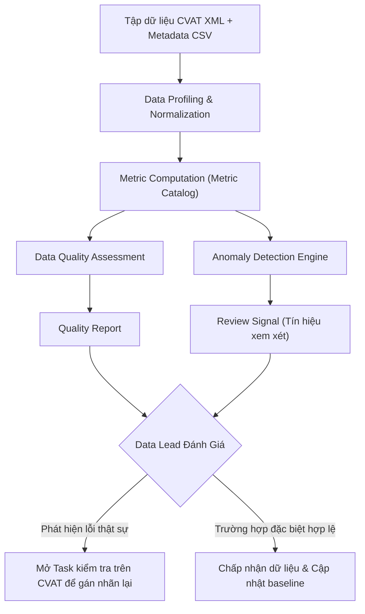

# Metric Catalog: N2-05B - Dashboard Phân Bố Class và Thuộc Tính Dữ Liệu

> **Tài liệu đặc tả danh mục chỉ số (Metric Catalog)**  
> **Dự án**: N2-05B - Website phân tích phân bố class và thuộc tính dữ liệu từ CVAT  
> **Đối tượng sử dụng**: Nhóm phát triển sinh viên, Data Lead, Annotation Team  
> **Trạng thái**: Đã chốt lý thuyết & đặc tả chuẩn (Trước khi bước vào Implementation)

---

## Mục lục

1. [Mục tiêu tài liệu](#1-mục-tiêu-tài-liệu)
2. [Nguyên tắc cốt lõi](#2-nguyên-tắc-cốt-lõi)
3. [Danh mục Metric chi tiết (Metric Catalog)](#3-danh-mục-metric-chi-tiết-metric-catalog)
   - [3.1 Dataset Metrics](#31-dataset-metrics)
   - [3.2 Class Metrics](#32-class-metrics)
   - [3.3 Image / Object Metrics](#33-image--object-metrics)
   - [3.4 Bounding Box Metrics](#34-bounding-box-metrics)
   - [3.5 Bounding Box Quality Metrics](#35-bounding-box-quality-metrics)
   - [3.6 Occlusion Metrics](#36-occlusion-metrics)
   - [3.7 Weather Metrics](#37-weather-metrics)
   - [3.8 Timeofday Metrics](#38-timeofday-metrics)
   - [3.9 Data Quality Metrics](#39-data-quality-metrics)
4. [Phương pháp thống kê mô tả](#4-phương-pháp-thống-kê-mô-tả)
5. [Quan hệ: Metric → Data Quality](#5-quan-hệ-metric--data-quality)
6. [Quan hệ: Metric → Anomaly Detection](#6-quan-hệ-metric--anomaly-detection)
7. [Cơ chế Review Signal](#7-cơ-chế-review-signal)
8. [Phân định độ ưu tiên MVP (P0 vs P1)](#8-phân-định-độ-ưu-tiên-mvp-p0-vs-p1)
9. [Những điều Metric KHÔNG ĐƯỢC kết luận](#9-những-điều-metric-không-được-kết-luận)
10. [Ví dụ minh họa End-to-End](#10-ví-dụ-minh-họa-end-to-end)
11. [Kết luận và các bước tiếp theo](#11-kết-luận-và-các-bước-tiếp-theo)

---

## 1. Mục tiêu tài liệu

Tài liệu này được biên soạn bằng tiếng Việt nhằm phục vụ nhóm sinh viên thực hiện dự án **N2-05B**. Mục đích chính là thống nhất toàn diện về mặt lý thuyết, phương pháp tính toán và ý nghĩa thực tế của tất cả các chỉ số (metrics) sẽ hiển thị trên dashboard hoặc dùng để phân tích chất lượng tập dữ liệu CVAT.

Tài liệu trả lời trực diện 7 câu hỏi trọng tâm:
1. **Dataset cần đo những chỉ số nào?**
2. **Mỗi chỉ số được tính như thế nào? (Công thức toán học & logic xử lý)**
3. **Input của metric là gì? (Cột dữ liệu, kiểu dữ liệu)**
4. **Output của metric là gì? (Giá trị số, tỷ lệ, bảng phân bố)**
5. **Metric có ý nghĩa gì đối với Data Lead?**
6. **Metric nào dùng để đánh giá Chất lượng Dữ liệu (Data Quality)?**
7. **Metric nào có thể làm đầu vào cho Phát hiện Bất thường (Anomaly Detection)?**

### Phân biệt 3 khái niệm nền tảng

Để tránh hiểu nhầm trong quá trình triển khai, toàn bộ thành viên trong nhóm phải tuân thủ phân tầng sau:

```
[ METRIC ]           -->  Mô tả sự thật khách quan của tập dữ liệu (distribution, counts, ratios)
       ↓
[ QUALITY METRIC ]   -->  Đo lường độ toàn vẹn, tính hợp lệ và độ bao phủ của dữ liệu (validity, completeness)
       ↓
[ ANOMALY RULE ]     -->  Phát hiện các mẫu (patterns) lệch bất thường cần con người kiểm tra (flag for review)
```

> **Ghi nhớ sống còn**: **Không được đồng nhất "Anomaly" (sự bất thường) với "Annotation Error" (lỗi gán nhãn).**  
> Một điểm dữ liệu bất thường (ví dụ: ảnh có 100 xe máy, hoặc class hiếm chỉ có 2 vật thể) có thể hoàn toàn chính xác theo thế giới thực (ví dụ: cảnh tắc đường ngã tư giờ cao điểm, hoặc loại xe chuyên dụng hiếm gặp). Metric chỉ phản ánh số liệu, không được vội vàng phán xét đúng/sai.

---

## 2. Nguyên tắc cốt lõi

Mọi thành viên phát triển và người dùng dashboard phải nắm vững các nguyên tắc sau:

1. **Định nghĩa và công thức minh bạch**: Mỗi metric phải có tên rõ ràng, định dạng đơn vị chuẩn (số nguyên, số thực, phần trăm) và công thức toán học tường minh.
2. **Không trộn lẫn Object Count và Image Count**:
   - `Object Count`: Số lượng vật thể (bounding box).
   - `Image Count`: Số lượng ảnh chứa ít nhất một vật thể đó.
   - Trộn lẫn hai số liệu này sẽ dẫn đến sai lệch nghiêm trọng khi đánh giá độ bao phủ dữ liệu.
3. **Không tự suy diễn nguyên nhân từ số liệu (No Speculation)**:
   - Metric chỉ mô tả hiện tượng, không giải thích động cơ hay nguyên nhân chủ quan của annotator.
4. **Không tự động kết luận lỗi gán nhãn**:
   - Không kết luận class ít xuất hiện là do annotator bỏ sót.
   - Không kết luận ảnh có nhiều box là do annotator gán nhầm.
5. **BBox size KHÔNG phản ánh khoảng cách vật lý**:
   - Kích thước bounding box nhỏ (`area_ratio` nhỏ) **không chứng minh** vật thể ở xa camera (vật thể có thể là một con ốc vít nhỏ đặt ngay sát ống kính).
6. **Phân biệt rạch ròi giữa `unknown` và `missing`**:
   - `missing`: Thuộc tính hoàn toàn chưa được nhập/chưa được thu thập trong dữ liệu.
   - `unknown`: Annotator đã quan sát kỹ nhưng dựa trên ngữ cảnh ảnh không thể xác định được (ví dụ: trời nhá nhem tối không rõ mây hay sương, thời tiết không thể nhận định).
   - Không được gộp hai trạng thái này vào nhau khi chưa có yêu cầu cụ thể.
7. **Tính toán dựa trên dữ liệu đã chuẩn hóa (Normalized Data)**:
   - Tất cả metrics được tính toán sau khi dữ liệu đã đi qua parser và schema chuẩn hóa (`images`, `objects`).
8. **Không âm thầm sửa dữ liệu đầu vào (No Silent Fixes)**:
   - Tool tuyệt đối không tự ý hoán đổi tọa độ `x_min`, `x_max`, không tự kẹp tọa độ (clamp) khi bounding box bị tràn viền (out-of-bounds) mà không ghi nhận.
9. **Ghi nhận riêng dữ liệu không hợp lệ (Invalid Data Quarantine)**:
   - Bản ghi lỗi phải được đếm và chuyển vào danh sách kiểm toán chất lượng (`Data Quality`), đồng thời loại khỏi các phép tính phân bố kích thước/tọa độ để không làm lệch thống kê chung.

---

## 3. Danh mục Metric chi tiết (Metric Catalog)

---

### 3.1 Dataset Metrics

Nhóm chỉ số ở cấp độ toàn bộ tập dữ liệu (dataset level), cung cấp cái nhìn tổng quan đầu tiên.

#### Danh sách chỉ số:

| Tên Metric | Kiểu dữ liệu | Mô tả | Công thức |
|---|---|---|---|
| `total_images` | Integer | Tổng số lượng ảnh có trong tập dữ liệu | $\sum 1$ cho mỗi bản ghi ảnh hợp lệ |
| `total_objects` | Integer | Tổng số lượng vật thể hợp lệ được đánh nhãn | $\sum 1$ cho mỗi bản ghi object hợp lệ |
| `total_classes` | Integer | Tổng số class phân biệt xuất hiện trong dataset | $\text{Count}(\text{Unique}(class\_name))$ |
| `annotated_image_count` | Integer | Số lượng ảnh có chứa ít nhất 1 bounding box | Số ảnh thỏa mãn: $N_{objects}(image) > 0$ |
| `unannotated_image_count` | Integer | Số lượng ảnh không có bất kỳ bounding box nào | Số ảnh thỏa mãn: $N_{objects}(image) = 0$ |

#### Quan hệ toán học quan trọng:
$$\text{annotated\_image\_count} + \text{unannotated\_image\_count} = \text{total\_images}$$

*Ý nghĩa cho Data Lead*:  
- Biết ngay quy mô tổng thể của đợt bàn giao dữ liệu.
- Tỷ lệ ảnh chưa gán nhãn (`unannotated_image_count`) giúp nhận diện sớm: dữ liệu này là ảnh nền có chủ đích (background / negative samples) hay annotator đang làm dở quy trình.

---

### 3.2 Class Metrics

Nhóm chỉ số đo lường phân bố theo từng lớp đối tượng (class level).

#### Danh sách chỉ số:

| Tên Metric | Kiểu dữ liệu | Mô tả | Công thức |
|---|---|---|---|
| `class_object_count` | Integer | Tổng số lượng vật thể thuộc về một class | $N_{objects}(c) = \sum_{obj \in dataset} \mathbb{I}(obj.class = c)$ |
| `class_image_count` | Integer | Số lượng ảnh có chứa ít nhất 1 vật thể thuộc class đó | $N_{images}(c) = \sum_{img \in dataset} \mathbb{I}(\exists obj \in img: obj.class = c)$ |
| `class_object_ratio` | Float [0.0, 1.0] | Tỷ lệ vật thể của class trên tổng số vật thể | $\frac{\text{class\_object\_count}(c)}{\text{total\_objects}}$ |
| `class_image_ratio` | Float [0.0, 1.0] | Tỷ lệ ảnh có xuất hiện class trên tổng số ảnh | $\frac{\text{class\_image\_count}(c)}{\text{total\_images}}$ |

#### Giải thích sự khác biệt giữa Object Count và Image Count:

Đây là lỗi phổ biến nhất của các bạn sinh viên khi mới làm việc với dữ liệu thị giác máy tính:
- **Object Count**: Đếm tổng số hộp (hộp thứ nhất, hộp thứ hai...).
- **Image Count**: Đếm số bức ảnh có sự hiện diện của lớp đó (ảnh có xuất hiện hay không, True/False).

> **Ví dụ trực quan dành cho sinh viên mới:**  
> Giả sử có một bức ảnh chụp bãi đỗ xe chứa **10 chiếc xe GreenSM**:
> - `class_object_count(GreenSM)` **tăng 10**.
> - `class_image_count(GreenSM)` **chỉ tăng 1**.
> 
> Nếu nhầm lẫn giữa hai chỉ số này, bạn sẽ nhận định sai lầm rằng "GreenSM xuất hiện rất phổ biến trên nhiều bối cảnh khác nhau", trong khi thực tế nó chỉ nằm dồn cục trong một bức ảnh duy nhất!

*Ý nghĩa cho Data Lead*:  
- Phát hiện hiện tượng mất cân bằng lớp (Class Imbalance).
- Phân biệt giữa class "nhiều cá thể nhưng tập trung ít ảnh" (dense clustering) và class "phân bố rải rác đồng đều trên nhiều ảnh" (broad coverage).

---

### 3.3 Image / Object Metrics

Nhóm chỉ số đo lường mật độ phân bố vật thể trên từng bức ảnh (per-image object density).

#### Danh sách chỉ số:

| Tên Metric | Kiểu dữ liệu | Mô tả | Công thức / Cách tính |
|---|---|---|---|
| `objects_per_image` | Series/List of Int | Mảng số lượng vật thể của từng bức ảnh | $[N_{objects}(img_1), N_{objects}(img_2), \dots, N_{objects}(img_n)]$ |
| `mean_objects_per_image` | Float | Trung bình số vật thể trên một ảnh | $\frac{\text{total\_objects}}{\text{total\_images}}$ |
| `median_objects_per_image` | Float | Trung vị số vật thể trên một ảnh | $\text{Median}(\text{objects\_per\_image})$ |
| `min_objects_per_image` | Integer | Số vật thể nhỏ nhất trong một ảnh | $\min(\text{objects\_per\_image})$ |
| `max_objects_per_image` | Integer | Số vật thể lớn nhất trong một ảnh | $\max(\text{objects\_per\_image})$ |
| `p25_objects_per_image` | Float | Bách phân vị thứ 25 | Phân vị 25% của dãy số đã sắp xếp |
| `p75_objects_per_image` | Float | Bách phân vị thứ 75 | Phân vị 75% của dãy số đã sắp xếp |
| `p90_objects_per_image` | Float | Bách phân vị thứ 90 | Phân vị 90% của dãy số đã sắp xếp |

*Ý nghĩa cho Data Lead*:  
- Phân biệt bối cảnh đơn giản (thưa thớt, ít vật thể) và bối cảnh phức tạp (đông đúc, tắc đường, che khuất chéo nhiều).
- Là đầu vào quan trọng cho Anomaly Detection để phát hiện các ảnh có mật độ dày đặc bất thường (`max_objects_per_image` vượt quá xa P90/P95).  
- **Lưu ý**: Tuyệt đối không kết luận ảnh có số lượng object lớn là ảnh bị gán nhãn sai.

---

### 3.4 Bounding Box Metrics

Nhóm chỉ số mô tả đặc trưng hình học của các hộp bao vật thể (2D bounding box). Giả định tọa độ gốc được định dạng theo chuẩn $[x_{min}, y_{min}, x_{max}, y_{max}]$ với hệ trục tọa độ pixel ảnh (gốc tọa độ $(0,0)$ ở góc trên bên trái).

#### Danh sách chỉ số:

| Tên Metric | Kiểu dữ liệu | Đơn vị | Công thức |
|---|---|---|---|
| `bbox_width` | Float | pixel | $w = x_{max} - x_{min}$ |
| `bbox_height` | Float | pixel | $h = y_{max} - y_{min}$ |
| `bbox_area` | Float | $\text{pixel}^2$ | $\text{area} = w \times h$ |
| `area_ratio` | Float [0.0, 1.0] | tỷ lệ | $\frac{\text{bbox\_area}}{W_{image} \times H_{image}}$ |

#### Thống kê phân bố liên tục cho Bounding Box:
Đối với mỗi thuộc tính liên tục (`bbox_width`, `bbox_height`, `bbox_area`, `area_ratio`), hệ thống tính toán bộ chỉ số thống kê gồm:
- **Min / Max**: Giá trị nhỏ nhất và lớn nhất.
- **Mean**: Giá trị trung bình số học.
- **Median**: Giá trị trung vị (chống chịu outlier tốt hơn mean).
- **Percentiles**: P10, P25, P75, P90, P99.
- **IQR (Interquartile Range)**: $IQR = P75 - P25$.

#### Nguyên tắc nhận định hình học quan trọng:
> **CẢNH BÁO: BBox size $\neq$ Object physical size hoặc Khoảng cách (Distance)**  
> - Bounding box nhỏ (`area_ratio` cực nhỏ) **KHÔNG CHỨNG MINH** vật thể ở khoảng cách xa. Vật thể nhỏ có thể là một biển báo nhỏ, vật thể bị che khuất gần hết hoặc một đồ vật kích thước bé thật sự.
> - Bounding box lớn **KHÔNG CHỨNG MINH** vật thể là xe tải hay công trình lớn. Một chiếc mũ bảo hiểm chụp sát ống kính có thể chiếm 80% diện tích ảnh.
> - Dashboard chỉ ghi nhận kích thước hình học trên ảnh (image space), không suy đoán kích thước vật lý trong thế giới thực (3D physical space).

---

### 3.5 Bounding Box Quality Metrics

Nhóm chỉ số phát hiện các lỗi hình học vi phạm tính toàn vẹn toán học của bounding box.

#### Danh sách chỉ số:

| Tên Metric | Kiểu dữ liệu | Điều kiện vi phạm | Ý nghĩa |
|---|---|---|---|
| `invalid_bbox_count` | Integer | $x_{min} \ge x_{max}$ HOẶC $y_{min} \ge y_{max}$ | Tọa độ bị đảo ngược hoặc suy biến thành đường/điểm |
| `zero_area_bbox_count` | Integer | $w \le 0$ HOẶC $h \le 0$ HOẶC $\text{area} \le 0$ | Bounding box không có diện tích |
| `out_of_bounds_bbox_count` | Integer | $x_{min} < 0$ HOẶC $y_{min} < 0$ HOẶC $x_{max} > W_{img}$ HOẶC $y_{max} > H_{img}$ | Hộp bao vượt ra ngoài kích thước khung hình ảnh |
| `invalid_image_dimension_count` | Integer | $W_{img} \le 0$ HOẶC $H_{img} \le 0$ | Kích thước ảnh metadata bằng 0 hoặc âm |

#### Quy tắc xử lý hệ thống:
1. **Tuyệt đối không tự động sửa (No Auto-fix)**: Tool không tự hoán đổi `x_min` và `x_max`, không tự ép box về biên `[0, W]`.
2. **Cách ly bản ghi lỗi (Quarantine)**: Toàn bộ bản ghi vi phạm các điều kiện trên phải được ghi nhận vào `Bounding Box Quality Metrics`, ghi log chi tiết mã ảnh/mã box, và **bị loại bỏ** khỏi các phép tính phân bố thống kê (tránh làm sai lệch `mean`, `median`, `area_ratio`).

---

### 3.6 Occlusion Metrics

Nhóm chỉ số mô tả mức độ che khuất của vật thể. Trong định dạng chuẩn CVAT, thuộc tính này thường là cờ nhị phân `occluded` (0 hoặc 1).

#### Danh sách chỉ số:

| Tên Metric | Kiểu dữ liệu | Mô tả | Công thức |
|---|---|---|---|
| `occluded_count` | Integer | Số lượng vật thể được đánh dấu bị che khuất (`occluded = 1`) | $\sum_{obj} \mathbb{I}(obj.occluded = 1)$ |
| `non_occluded_count` | Integer | Số lượng vật thể không bị che khuất (`occluded = 0`) | $\sum_{obj} \mathbb{I}(obj.occluded = 0)$ |
| `occlusion_rate` | Float [0.0, 1.0] | Tỷ lệ vật thể bị che khuất trên toàn bộ dataset | $\frac{\text{occluded\_count}}{\text{total\_objects}}$ |
| `occlusion_rate_by_class` | Float [0.0, 1.0] | Tỷ lệ vật thể bị che khuất riêng của từng class $c$ | $\frac{\text{occluded\_count}(c)}{\text{class\_object\_count}(c)}$ |

*Ý nghĩa cho Data Lead*:  
- Giúp đánh giá độ khó và tính thách thức của tập dữ liệu đối với mô hình thị giác máy tính.
- Nếu một class có `occlusion_rate` quá thấp (ví dụ xe máy chỉ 1% che khuất trong bối cảnh giao thông đông đúc), đây là tín hiệu cảnh báo annotator có thể đang bỏ quên việc tích chọn nhãn che khuất.
- **Lưu ý**: Tỷ lệ che khuất cao không đồng nghĩa với việc gán nhãn sai, mà thường phản ánh môi trường thực tế đông đúc.

---

### 3.7 Weather Metrics

Nhóm chỉ số mô tả điều kiện thời tiết của cảnh chụp ảnh. Dữ liệu thời tiết thường đến từ thẻ tag XML hoặc file CSV metadata ghép nối.

#### Các trạng thái chuẩn hóa:
- `clear` (Trời quang / Nắng)
- `rain` (Mưa)
- `fog` (Sương mù)
- `overcast` (Nhiều mây / U ám)
- `unknown` (Đã kiểm tra nhưng không xác định được)
- `missing` (Không có trường thông tin này trong metadata)

#### Danh sách chỉ số:

| Tên Metric | Kiểu dữ liệu | Mô tả | Công thức |
|---|---|---|---|
| `weather_image_count` | Integer (theo trạng thái) | Số lượng ảnh thuộc từng trạng thái thời tiết | $\sum_{img} \mathbb{I}(img.weather = state)$ |
| `weather_image_ratio` | Float [0.0, 1.0] | Tỷ lệ số ảnh của từng trạng thái thời tiết | $\frac{\text{weather\_image\_count}(state)}{\text{total\_images}}$ |
| `weather_distribution` | Dict / Table | Bảng phân bố tổng hợp số lượng và tỷ lệ ảnh theo thời tiết | Bảng tổng hợp các trạng thái |
| `weather_object_distribution` | Dict / Table (Tùy chọn) | Phân bố số lượng vật thể tương ứng với từng điều kiện thời tiết | $\sum_{obj \in img: img.weather = state} 1$ |

#### Quy tắc phân biệt nghiêm ngặt:
- `unknown` $\neq$ `missing`: Annotator nhìn ảnh nhưng không rõ thời tiết khác hoàn toàn với việc pipeline thu thập bị mất metadata thời tiết. Tuyệt đối không gộp 2 nhóm này nếu không có chỉ định từ Data Lead.
- Điều kiện thời tiết hiếm gặp (ví dụ tập dữ liệu chỉ có 2 ảnh `fog`) không đồng nghĩa với việc metadata bị gán sai.

---

### 3.8 Timeofday Metrics

Nhóm chỉ số mô tả điều kiện thời điểm trong ngày (ánh sáng môi trường) của cảnh chụp.

#### Các trạng thái chuẩn hóa:
- `day` (Ban ngày)
- `night` (Ban đêm)
- `dawn_dusk` (Bình minh / Hoàng hôn)
- `unknown` (Đã xem nhưng không xác định được)
- `missing` (Thiếu thông tin metadata)

#### Danh sách chỉ số:

| Tên Metric | Kiểu dữ liệu | Mô tả | Công thức |
|---|---|---|---|
| `timeofday_image_count` | Integer (theo trạng thái) | Số lượng ảnh thuộc từng thời điểm trong ngày | $\sum_{img} \mathbb{I}(img.timeofday = state)$ |
| `timeofday_image_ratio` | Float [0.0, 1.0] | Tỷ lệ số ảnh của từng thời điểm trong ngày | $\frac{\text{timeofday\_image\_count}(state)}{\text{total\_images}}$ |
| `timeofday_distribution` | Dict / Table | Bảng phân bố tổng hợp số lượng và tỷ lệ ảnh theo thời điểm | Bảng tổng hợp các trạng thái |

#### Quy tắc nhận định:
- Tuyệt đối không tự ý dùng thuật toán đo độ sáng ảnh (pixel brightness) để gán nhãn `day` hay `night` khi chưa có đặc tả chính thức, vì ảnh chụp ban ngày trong hầm tối vẫn là ban ngày theo ngữ cảnh metadata.

---

### 3.9 Data Quality Metrics

Nhóm chỉ số đánh giá mức độ sạch, độ đầy đủ và tính tuân thủ của tập dữ liệu trước khi đưa vào huấn luyện.

#### Danh sách chỉ số:

| Tên Metric | Kiểu dữ liệu | Mô tả | Mức độ phụ thuộc |
|---|---|---|---|
| `missing_metadata_count` | Integer | Số lượng ảnh bị thiếu thông tin thời tiết hoặc thời điểm trong ngày | Dữ liệu chuẩn hóa |
| `unknown_metadata_count` | Integer | Số lượng ảnh được gắn trạng thái `unknown` ở thời tiết hoặc thời điểm | Dữ liệu chuẩn hóa |
| `invalid_record_count` | Integer | Tổng số lượng bản ghi (image hoặc object) bị lỗi cấu trúc dữ liệu hoặc tọa độ | Validation engine |
| `unsupported_shape_count` | Integer | Số lượng nhãn không phải dạng hộp chữ nhật (polygon, polyline, points) bị bỏ qua | Phụ thuộc Parser implementation |
| `images_without_annotation` | Integer | Số lượng ảnh không có bất kỳ annotation nào (`unannotated_image_count`) | Parser & Schema |
| `images_without_scene_info` | Integer | Số lượng ảnh không có cả thông tin weather lẫn timeofday | Schema chuẩn hóa |

---

## 4. Phương pháp thống kê mô tả

Đối với các biến số liên tục (ví dụ: `objects_per_image`, `bbox_width`, `bbox_height`, `area_ratio`), việc chọn đúng chỉ số thống kê là cực kỳ quan trọng để không đưa ra bức tranh sai lệch về dữ liệu.

### So sánh và Hướng dẫn áp dụng:

| Chỉ số | Khái niệm toán học | Điểm mạnh | Hạn chế lớn | Khuyến nghị sử dụng |
|---|---|---|---|---|
| **Count** | Tổng số phần tử quan sát | Đơn giản, nắm bắt kích thước mẫu | Không phản ánh độ phân bố | Luôn hiển thị đầu tiên |
| **Min / Max** | Cực tiểu và cực đại | Xác định giới hạn biên | Cực kỳ nhạy cảm với dữ liệu dị biệt (noise/outlier) | Kiểm tra ranh giới dữ liệu và lỗi tọa độ |
| **Mean** | Trung bình cộng: $\bar{x} = \frac{1}{n}\sum x_i$ | Tận dụng toàn bộ thông tin mẫu | **Bị méo mó nặng nề khi có outlier** | Chỉ dùng khi phân bố tương đối đối xứng (chuẩn) |
| **Median** | Giá trị nằm chính giữa tập số đã sắp xếp | **Miễn nhiễm với outlier**, phản ánh đúng trung tâm | Bỏ qua sự biến thiên ở hai đầu | **Khuyên dùng chính** cho kích thước bbox & số object/ảnh |
| **Percentile** (P10, P25, P75, P90) | Giá trị mà tại đó có $k\%$ số quan sát nhỏ hơn nó | Cho biết lát cắt cụ thể của phân bố | Đòi hỏi sắp xếp dữ liệu | Phân nhóm kích thước (nhỏ, vừa, lớn) |
| **IQR** | $IQR = P75 - P25$ | Đo độ phân tán của 50% dữ liệu vùng giữa | Bỏ qua dữ liệu 2 đuôi | Dùng thiết lập ngưỡng phát hiện bất thường (Boxplot rule) |

### Lưu ý thực tế cho nhóm sinh viên:
Phân bố kích thước vật thể trong Computer Vision hầu như luôn là **phân bố lệch phải (right-skewed)**: có vô số vật thể kích thước nhỏ và rất ít vật thể khổng lồ.
- Nếu chỉ nhìn vào **Mean**, giá trị trung bình sẽ bị kéo lên rất cao do một vài vật thể to bất thường.
- Do đó, **Median và Percentile** luôn là bộ đôi trung thực nhất để mô tả đặc trưng tập dữ liệu.

---

## 5. Quan hệ: Metric → Data Quality

Bảng đối chiếu dưới đây làm rõ ranh giới: Metric giúp phát hiện vấn đề gì, và những kết luận nào bị nghiêm cấm.

| Metric | Có thể giúp kiểm tra gì? (Use Case) | KHÔNG ĐƯỢC kết luận gì? (Fallacy cấm đoán) |
|---|---|---|
| `class_object_ratio` | Độ cân bằng giữa các lớp đối tượng trong tập train/val | Không kết luận lớp chiếm tỷ lệ nhỏ là lỗi gán nhãn |
| `class_image_ratio` | Độ phân tán của lớp đối tượng qua các bối cảnh ảnh | Không kết luận lớp có tỷ lệ ảnh thấp là thiếu dữ liệu thực tế |
| `objects_per_image` | Mật độ phân bố cảnh chụp (cảnh thưa vs cảnh tắc nghẽn) | Không kết luận ảnh có 0 object hoặc quá nhiều object là sai |
| `area_ratio` | Phân bố tỷ lệ diện tích của bounding box trên ảnh | Không kết luận bbox rất nhỏ là vật thể ở xa camera |
| `invalid_bbox_count` | Lỗi cú pháp hình học ($x_{min} \ge x_{max}$, v.v.) | Không tự sửa tọa độ; ghi nhận lỗi chính xác |
| `out_of_bounds_bbox_count` | Hộp bao bị lọt ra ngoài phạm vi biên ảnh | Không tự cắt xén (clip) mà không thông báo |
| `occlusion_rate` | Tỷ lệ vật thể bị che chắn trong môi trường quan sát | Không kết luận tỷ lệ che khuất cao là annotator tích bừa |
| `missing_metadata_count` | Mức độ thất thoát thông tin trong quá trình ghép nối CSV | Không tự đoán dữ liệu bị thiếu (ví dụ: thấy ảnh tối tự điền night) |
| `weather_image_ratio` | Độ bao phủ các điều kiện thời tiết thực tế | Không kết luận thời tiết hiếm (bão, sương mù) là metadata sai |
| `unsupported_shape_count` | Số lượng hình dạng nhãn lạ chưa được hệ thống hỗ trợ | Không coi nhãn polygon là rác dữ liệu |

---

## 6. Quan hệ: Metric → Anomaly Detection

Metric không trực tiếp phán quyết dữ liệu bất thường. **Metric là đầu vào (Features/Inputs)**, còn **Rule và Threshold** mới là bộ lọc quyết định việc phát ra cảnh báo.

| Metric đầu vào | Có thể làm input cho Anomaly Detection? | Ví dụ Rule / Ngưỡng kích hoạt cảnh báo |
|---|:---:|---|
| `objects_per_image` | **Có** | Cảnh báo khi $N_{objects} > \text{Median} + 3 \times IQR$ (Ảnh đông đúc bất thường) |
| `area_ratio` | **Có** | Cảnh báo khi $\text{area\_ratio} < 0.0001$ (Bbox siêu nhỏ dưới 4x4 pixel) |
| `bbox_width`, `bbox_height` | **Có** | Cảnh báo khi tỷ lệ cạnh $\frac{w}{h} > 10$ hoặc $\frac{w}{h} < 0.1$ (Box mảnh bất thường) |
| `class_object_ratio` | **Có** | Cảnh báo khi tỷ lệ một class $< 0.1\%$ toàn bộ tập dữ liệu (Lớp cực hiếm) |
| `occlusion_rate_by_class` | **Có** | Cảnh báo khi một class thường xuyên bị che khuất bỗng có tỷ lệ che khuất = 0% |
| `weather_image_ratio` | **Có** | Cảnh báo khi tỷ lệ ảnh trời mưa rơi vào khoảng $0 < \text{ratio} < 0.005$ |
| `invalid_bbox_count` | **Có** | Kích hoạt ngay lập tức cảnh báo nghiêm trọng nếu $\text{count} > 0$ |
| `missing_metadata_count` | **Có** | Cảnh báo khi tỷ lệ ảnh thiếu metadata vượt quá $10\%$ |

> **Nguyên tắc then chốt**:  
> Metric cung cấp số đo khách quan. Một số đo chỉ biến thành **Review Signal** khi nó vượt qua ngưỡng do **Data Lead quy định trước**.

---

## 7. Cơ chế Review Signal

Quy trình khép kín từ lúc nạp dữ liệu đến khi kiểm tra lỗi trên CVAT được mô hình hóa qua luồng sau:



### Ý nghĩa thực tế của Review Signal:
- **Review Signal KHÔNG PHẢI là kết luận lỗi gán nhãn**.
- Review Signal trả lời duy nhất một câu hỏi:  
  **"Có điểm gì bất thường hoặc đáng ngờ mà Data Lead nên dành thời gian kiểm tra lại hay không?"**
- Nhờ có Review Signal, Data Lead không cần phải rà soát thủ công hàng chục nghìn bức ảnh, mà chỉ tập trung vào nhóm 1-2% ảnh có dấu hiệu bất thường cao nhất.

---

## 8. Phân định độ ưu tiên MVP (P0 vs P1)

Để đảm bảo dự án hoàn thành đúng hạn và hoạt động ổn định, nhóm thống nhất phân định phạm vi chức năng rõ ràng:

### Nhóm P0: Bắt buộc phải có trong phiên bản MVP đầu tiên
- Toàn bộ **Dataset Metrics** (`total_images`, `total_objects`, `total_classes`, `annotated_image_count`, `unannotated_image_count`).
- Toàn bộ **Class Metrics** (`class_object_count`, `class_image_count`, `class_object_ratio`, `class_image_ratio`).
- Chỉ số phân bố mật độ `objects_per_image` (Min, Max, Mean, Median).
- Toàn bộ **Bounding Box Metrics** cơ bản (`bbox_width`, `bbox_height`, `bbox_area`, `area_ratio`).
- Toàn bộ **Bounding Box Quality Metrics** (`invalid_bbox_count`, `out_of_bounds_bbox_count`, `zero_area_bbox_count`, `invalid_image_dimension_count`).
- **Occlusion Metrics** cơ bản (`occluded_count`, `non_occluded_count`, `occlusion_rate`).
- **Weather Metrics** và **Timeofday Metrics** cấp độ ảnh.
- **Data Quality Metrics** cơ bản (`missing_metadata_count`, `unknown_metadata_count`, `invalid_record_count`).
- Bộ lọc kết hợp cơ bản (Filter theo class, thời tiết, thời điểm).

### Nhóm P1: Mở rộng sau khi MVP hoàn tất và kiểm chứng ổn định
- Thống kê nâng cao: Percentiles chi tiết (P01, P05, P95, P99), biểu đồ phân vị phân tán IQR Boxplot phức tạp.
- Phân tích tương quan đa chiều kết hợp nhiều thuộc tính (ví dụ: `area_ratio` theo từng `weather` và `timeofday`).
- Thống kê phân bố vật thể theo vùng không gian nhiệt (Heatmap tọa độ tâm box).
- Báo cáo đối chiếu mục tiêu đa kịch bản nâng cao.

> **Ranh giới công nghệ dứt khoát**:  
> **TUYỆT ĐỐI KHÔNG đưa Machine Learning / Deep Learning Anomaly Detection vào MVP.**  
> MVP chỉ sử dụng các luật thống kê mô tả (Descriptive Rule-based) có thể giải thích được 100% bằng toán học.

---

## 9. Những điều Metric KHÔNG ĐƯỢC kết luận

Đây là bộ quy tắc kỷ luật tư duy bắt buộc đối với toàn bộ thành viên nhóm dự án:

1. ❌ **Lớp hiếm (Rare Class) $\neq$ Lỗi gán nhãn (Annotation Error)**:
   - Một class chỉ có vài mẫu có thể phản ánh chính xác thực tế cuộc sống (ví dụ xe cứu thương, động vật băng qua đường).
2. ❌ **Lớp chiếm đa số (Dominant Class) $\neq$ Lỗi gán nhãn**:
   - Class xe máy chiếm 80% là hiện trạng giao thông Việt Nam, không phải do annotator thiên vị.
3. ❌ **Bounding Box nhỏ $\neq$ Vật thể ở khoảng cách xa**:
   - BBox nhỏ chỉ đơn thuần là diện tích pixel nhỏ, không khẳng định chiều sâu trong không gian vật lý 3D.
4. ❌ **Ảnh không có Bounding Box $\neq$ Ảnh nền (Background Sample)**:
   - Ảnh không có box có thể là ảnh nền hợp lệ, nhưng cũng có thể là annotator vô tình bỏ sót. Cần Data Lead xác nhận.
5. ❌ **Thời tiết hiếm gặp $\neq$ Metadata bị sai**:
   - Một tập dữ liệu giao thông có 2 ảnh trời sương mù dày đặc là dữ liệu quý giá, không phải lỗi nhập liệu.
6. ❌ **Phát hiện bất thường (Anomaly) $\neq$ Dữ liệu sai**:
   - Bất thường chỉ mang tính thống kê (nằm ở đuôi phân bố), không đồng nghĩa với sai sót kỹ thuật.
7. ❌ **Phân bố đẹp / cân bằng $\neq$ Dữ liệu chắc chắn chất lượng cao**:
   - Dữ liệu có thể cân bằng hoàn hảo nhưng toàn bộ tọa độ bounding box bị lệch tâm hoặc gắn sai tên lớp.
8. ❌ **Phân bố lệch $\neq$ Dữ liệu hỏng**:
   - Tự nhiên vốn dĩ không cân bằng; phân bố lệch là trạng thái bình thường của dữ liệu thực tế.
9. ❌ **Metric thay đổi $\neq$ Hiệu năng mô hình chắc chắn tăng**:
   - Dashboard không đưa ra lời hứa hẹn về độ chính xác (mAP, F1-score) của mô hình AI sau này.

> **Phương châm cốt lõi**:  
> **Tool hỗ trợ Data Lead ra quyết định nhanh hơn, chứ Tool không thay thế nhận định chuyên môn của Data Lead.**

---

## 10. Ví dụ minh họa End-to-End

Để minh họa cách thức tính toán và quy trình xử lý, xét tập dữ liệu kiểm thử giả định sau:

### Dữ liệu đầu vào:
- **Tổng số ảnh (`total_images`)**: $100$ ảnh
- **Tổng số vật thể (`total_objects`)**: $200$ vật thể
- **Số lớp đối tượng (`total_classes`)**: $2$ lớp (`Class A`, `Class B`)

Thống kê chi tiết từng lớp:
- **Class A**: Có $180$ vật thể, xuất hiện rải rác trên $60$ bức ảnh.
- **Class B**: Có $20$ vật thể, xuất hiện tập trung trong $15$ bức ảnh.

---

### Các bước tính toán Metric:

#### 1. Tính toán Class Object Ratio:
$$\text{class\_object\_ratio}(A) = \frac{\text{class\_object\_count}(A)}{\text{total\_objects}} = \frac{180}{200} = 0.90 \quad (90\%)$$

$$\text{class\_object\_ratio}(B) = \frac{\text{class\_object\_count}(B)}{\text{total\_objects}} = \frac{20}{200} = 0.10 \quad (10\%)$$

#### 2. Tính toán Class Image Ratio:
$$\text{class\_image\_ratio}(A) = \frac{\text{class\_image\_count}(A)}{\text{total\_images}} = \frac{60}{100} = 0.60 \quad (60\%)$$

$$\text{class\_image\_ratio}(B) = \frac{\text{class\_image\_count}(B)}{\text{total\_images}} = \frac{15}{100} = 0.15 \quad (15\%)$$

---

### Phân tích ý nghĩa và Cách ứng xử của hệ thống:

1. **Quan sát số liệu khách quan**:
   - Class A chiếm đa số áp đảo về số lượng cá thể ($90\%$ tổng vật thể) và có mặt trong phần lớn tập ảnh ($60\%$ số ảnh).
   - Class B chiếm thiểu số ($10\%$ số vật thể) và chỉ xuất hiện trong $15\%$ số ảnh.

2. **Xử lý cảnh báo (Review Signal)**:
   - Giả sử hệ thống cài đặt Rule: `Nếu class_object_ratio < 0.15 → Phát tín hiệu Review Signal: Lớp có dung lượng nhỏ (Minority Class)`.
   - Hệ thống phát tín hiệu cảnh báo cho `Class B`.

3. **Nguyên tắc hành xử đúng đắn**:
   - Dashboard **TUYỆT ĐỐI KHÔNG ĐƯỢC KẾT LUẬN**: *"Class B bị gán nhãn thiếu hoặc bị gán sai"*.
   - Dashboard hiển thị thông tin:  
     `[SIGNAL] Class B có tỷ lệ vật thể 10% (ngưỡng < 15%). Đề xuất kiểm tra 15 ảnh chứa Class B trên CVAT.`
   - **Data Lead** click vào danh sách 15 ảnh này, mở trực tiếp liên kết sang CVAT để thẩm định:
     - Nếu ngoài đời thực cảnh quay ít có Class B: **Xác nhận dữ liệu hợp lệ**.
     - Nếu phát hiện annotator bỏ sót Class B ở các ảnh khác: **Yêu cầu gán nhãn bổ sung**.

---

## 11. Kết luận và các bước tiếp theo

File đặc tả **Metric Catalog** này là văn bản pháp lý kỹ thuật và nền tảng chuẩn hóa cho toàn bộ các pha công việc kế tiếp của dự án N2-05B. Mọi logic tính toán trong mã nguồn Python (`core/statistics.py`, `core/validation.py`) bắt buộc phải bám sát tuyệt đối các định nghĩa và công thức trong tài liệu này.

### Lộ trình chuyển tiếp (Next Steps):

```
[ METRIC CATALOG ]  (Tài liệu hiện tại - Đã hoàn thành)
       │
       ▼
[ IMPLEMENTATION ]  (Xây dựng parser, schema, module validation & statistics trong core/)
       │
       ▼
[ DATA QUALITY ]    (Kiểm thử tự động trên tập test fixture & đo lường các chỉ số chất lượng)
       │
       ▼
[ ANOMALY DETECTION ] (Cấu hình rule ngưỡng phát hiện điểm dị biệt dựa trên metrics)
       │
       ▼
[ REVIEW SIGNAL ]   (Xuất danh sách cảnh báo kèm ID ảnh để mở ngược lại CVAT)
       │
       ▼
[ DASHBOARD UI ]    (Trực quan hóa biểu đồ Plotly và bộ lọc Streamlit tương tác cho người dùng)
```

---
*Tài liệu thuộc khuôn khổ dự án N2-05B. Mọi đề xuất chỉnh sửa hoặc bổ sung metric phải được thảo luận và thông qua bởi toàn bộ thành viên nhóm.*
